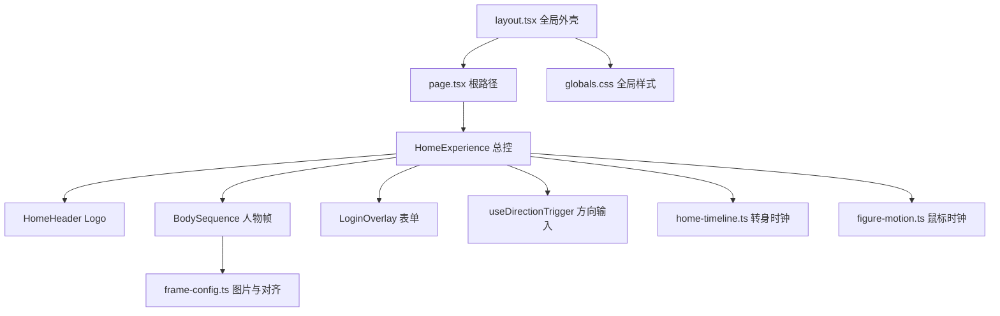
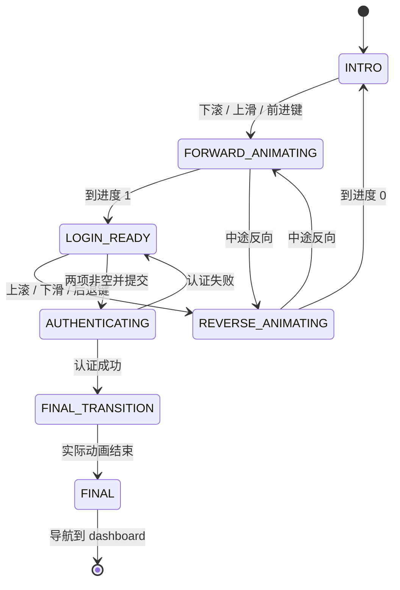
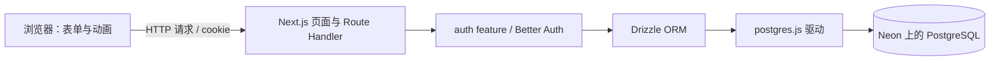
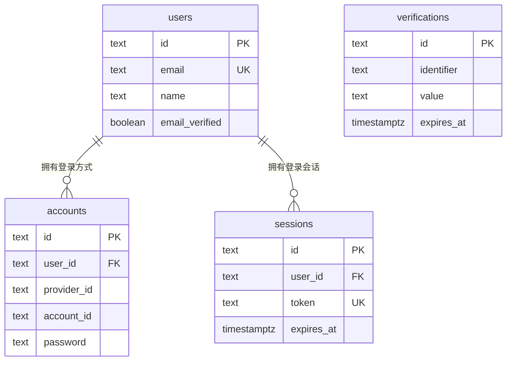
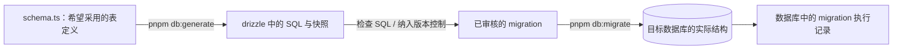
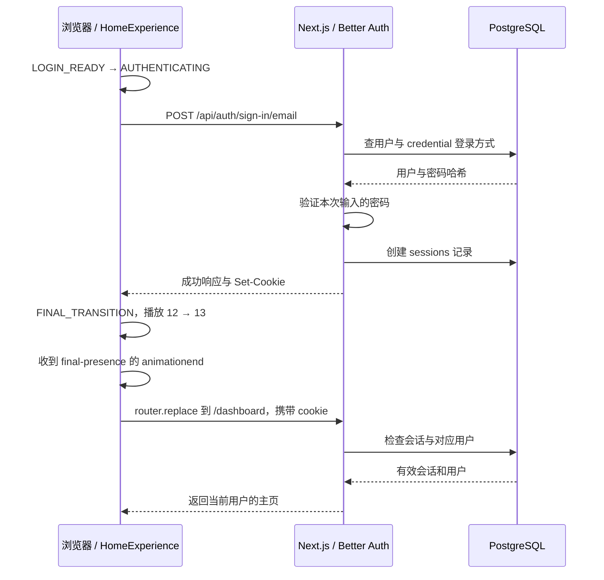

# Formward 代码自学指南

学习基准日期：**2026 年 10 月 3 日**。

本文按照当前仓库里的实际代码讲解，从文件阅读顺序、React 写法、人物图片配置，到 CSS、动画时钟、鼠标和键盘事件，再到数据库、账号、密码哈希与登录会话。建议一边打开页面，一边在编辑器中对照对应文件。后续代码或参数变化时，本文中的参数表和行为说明也应同步更新。

快速跳转：

- [推荐阅读路线](#reading-route)：按文件顺序学习。
- [React 与 TypeScript 写法](#language-basics)：理解 JSX、props、state、ref、effect。
- [CSS 逐组讲解](#css-guide)：理解颜色、尺寸、位置、合成与媒体查询。
- [首页状态与数据流](#home-coordination)：继续阅读转身、方向输入和鼠标系统。
- [参数索引](#parameters)：直接找“想改什么”对应的文件与数值。
- [修改练习](#exercises)：按具体示例实践。
- [测试与验收](#verification)：知道修改后如何检查。
- [调试方法](#debugging)：通过开发者工具定位问题。
- [数据库与认证学习路线](#database-learning)：从技术栈到实际文件，回看本次完成的功能。
- [四张认证表](#auth-tables)：理解用户、登录方式、会话与验证记录的关系。
- [连接与 migration](#database-migrations)：区分配置数据库、生成 SQL、执行建表和创建账号。
- [密码哈希](#password-hashing)：理解 scrypt、随机盐与密码验证。
- [登录到主页的完整流程](#login-flow)：把请求、cookie、动画与服务端检查连起来。
- [数据库验证与学习练习](#database-verification)：用隔离测试和只读查询理解当前实现。

## 1. 先知道当前项目做到哪里

当前可以运行的是首页人物动画、真实登录、会话、退出和受保护的主页。页面使用 13 张人物图片，滚动负责选择转身方向，独立时间线自动播放，表单跟着转身进度出现。鼠标可以造成很小的视差，输入框聚焦后人物回中。

登录表单在组件内存里保留输入值，点击 ENTER 先向 Better Auth 验证凭据。成功后播放第 12 张到第 13 张的过渡，实际 CSS 动画结束后进入 `/dashboard`。失败保持在表单；密码不进入浏览器持久存储，数据库只保存 scrypt 哈希。

`src/features/auth`、`src/db` 和 `drizzle` 已有认证运行代码及 migration。饮食、运动、身体指标和 AI API 仍是后续业务方向。数据库配置与内部账号创建见 [接入指南](auth-setup.md)。

当前运行依赖包括 Next.js、React、Better Auth、Drizzle 与 postgres.js。Tailwind、TypeScript、ESLint、Drizzle Kit、tsx 和用于隔离测试 / 本机开发的 PGlite 属于开发依赖。shadcn/ui、Vitest 和 Playwright 尚未成为项目依赖；浏览器验收使用临时安装的 Playwright。判断是否安装某个库，以 [package.json](../package.json) 为准。

<a id="reading-route"></a>

## 2. 推荐阅读路线：从哪里看到哪里

第一遍先看页面如何组成，不必从最复杂的动画公式开始。第二遍再沿着一次滚动事件看数据如何流动。

| 顺序 | 打开文件 | 本轮重点 | 看懂后的目标 |
| --- | --- | --- | --- |
| 1 | [根 README](../README.md)、[当前状态](status.md)、[页面方案](interface.md) | 如何启动、当前行为、设计边界 | 能打开页面并说出一次滚动和 ENTER 分别做什么 |
| 2 | [package.json](../package.json)、[next.config.ts](../next.config.ts)、[tsconfig.json](../tsconfig.json) | 命令、开发来源、类型检查 | 分清源码、工具配置与构建产物 |
| 3 | [layout.tsx](../src/app/layout.tsx) → [page.tsx](../src/app/page.tsx) | 全局外壳与 `/` 路由 | 明白首页入口在哪里 |
| 4 | [home-experience.tsx](../src/app/home-experience.tsx) 的最后一个 `return` | DOM 结构、组件和类名 | 找到人物、表单、Logo、SCROLL 各自的位置 |
| 5 | [home-header.tsx](../src/app/home-header.tsx)、[login-overlay.tsx](../src/app/login-overlay.tsx) | JSX、props、受控输入、回调 | 知道文案、输入值和按钮条件由谁控制 |
| 6 | [frame-config.ts](../src/app/frame-config.ts) → [body-sequence.tsx](../src/app/body-sequence.tsx) | 素材、帧顺序、对齐值、CSS 变量 | 能定位某张人物图的大小和位置配置 |
| 7 | [globals.css](../src/app/globals.css) 从上往下 | 色板、人物三层、表单、提示、媒体查询 | 能通过类名找到视觉参数 |
| 8 | [use-direction-trigger.ts](../src/app/use-direction-trigger.ts) → `requestDirection` | 意图、阈值、目标端点 | 明白为什么滚一下就能自动播完 |
| 9 | [home-timeline.ts](../src/app/home-timeline.ts) → `renderProgress` | 时间游标、帧权重、表单浮现 | 能区分总播放时间和相邻帧交叠时间 |
| 10 | [figure-motion.ts](../src/app/figure-motion.ts) → `updateMotion` / `focusInput` | 视差、回中、状态锁定 | 能调整鼠标幅度与响应速度 |
| 11 | 两份源码旁的单元测试 → [浏览器验收](../tests/home-experience.browser.mjs) | 模拟时间与真实截图 | 能判断改动之后应该检查什么 |
| 12 | [目录检查脚本](../scripts/check-structure.sh) 与其他目录 README | 工具和后续业务边界 | 不会把工具文件或预留目录误当作页面代码 |

每一轮阅读可以回答三个问题：这个文件接收什么、它改变什么、结果交给谁。遇到参数先在本文第 14 节查位置，再回到原文件确认上下文。

## 3. 文件类型与目录地图

### 3.1 文件后缀是什么意思

| 后缀 / 文件 | 当前项目中的用途 | 怎么读 / 改 |
| --- | --- | --- |
| `.ts` | 带类型的 TypeScript，常用于配置、计算和控制器 | 先看 `export`，再看函数输入与返回值 |
| `.tsx` | TypeScript 加 JSX，用来描述 React 界面 | 先看 `return` 的界面，再看 state、事件和 effect |
| `.css` | 布局、颜色、字体、视觉效果及 CSS 动画 | 从 JSX 的 `className` 搜索对应选择器 |
| `.mjs` | 明确使用 ES module 的 JavaScript；当前主要是配置与测试 | 看 `import`、`export` 和测试入口，不依赖 TypeScript 类型 |
| `.json` | 严格的数据 / 工具配置格式 | 属性名加双引号；不能写 `//` 注释或多余尾逗号 |
| `.md` | 产品说明、学习材料与维护约定 | 不会直接变成页面上的文字 |
| `.sh` | Bash 维护脚本 | 在终端执行，通常与网站运行逻辑无关 |
| `.png` | 带透明度的人物素材 | 原图内容、清晰度和姿态不由 CSS 重新生成 |
| `pnpm-lock.yaml` | 包管理器记录的精确依赖解析结果 | 安装命令维护，通常不手改 |
| `next-env.d.ts` | Next.js 生成的类型声明入口 | 不当作页面源码编辑 |
| `tsconfig.tsbuildinfo` | TypeScript 增量检查缓存 | 可以重新生成，不是可调参数 |
| `*.png:Zone.Identifier` | 仓库中现有的文件来源附带信息 | 当前首页没有导入或读取这些文件，不控制显示效果 |

### 3.2 完整职责地图

```text
Formward/
├─ package.json                  命令和依赖
├─ pnpm-lock.yaml                精确依赖版本
├─ .nvmrc                        Node.js 版本
├─ next.config.ts                Next.js 开发配置
├─ tsconfig.json                 TypeScript 配置
├─ eslint.config.mjs             代码检查规则
├─ postcss.config.mjs            Tailwind 的 CSS 处理入口
├─ .gitignore                    不纳入版本控制的内容
├─ AGENTS.md                     仓库协作与安全约定
├─ PROJECT_BOOTSTRAP.md           技术初始化参考
├─ src/app/
│  ├─ layout.tsx                 HTML 外壳、metadata、全局 CSS 引入
│  ├─ page.tsx                   根路径页面
│  ├─ home-experience.tsx        首页状态与各系统协调
│  ├─ home-header.tsx            Logo 的 JSX
│  ├─ frame-config.ts           图片、帧顺序、桌面 / 手机对齐
│  ├─ body-sequence.tsx          挂载全部人物帧
│  ├─ login-overlay.tsx          表单输入、校验、提交与焦点回调
│  ├─ globals.css                视觉样式、响应式、最终 CSS 动画
│  ├─ use-direction-trigger.ts  滚轮 / 触摸 / 键盘方向识别
│  ├─ home-timeline.ts           转身时间线、帧权重、表单进度
│  ├─ figure-motion.ts           鼠标视差与回稳控制器
│  ├─ home-timeline.test.mjs      时间线与方向识别单元测试
│  └─ figure-motion.test.mjs      视差与回稳单元测试
├─ src/features/                 后续业务功能，当前只有职责 README
├─ src/db/                       PostgreSQL 连接和认证 schema
├─ src/components/               后续跨页面复用组件
├─ public/images/                1.png 至 13.png
├─ public/icons/                 公开图标目录，当前有 README
├─ tests/home-experience.browser.mjs  真实浏览器验收
├─ scripts/check-structure.sh    自有目录 README 检查
├─ docs/                         产品、界面、架构、校准和本指南
├─ data/imports/                 本地原始导入文件，不是网站资源
├─ data/exports/                 本地报告与导出
└─ drizzle/                      已版本化的数据库迁移历史
```

`node_modules` 是安装的第三方代码，`.next` 是 Next.js 生成的开发 / 构建内容。学习当前功能时主要读 `src`，不从这两个目录里的产物开始改。确实需要确认当前版本 API 时，可以读 `node_modules/next/dist/docs/` 的安装版文档。

`docs/20261002Prompt.md` 和 `docs/20261002Prompt2.md` 保存需求输入，不参与程序执行。当前已经采用的参数和交互以实际源码、`interface.md`、`status.md` 为准。

## 4. 页面到底如何组成

### 4.1 组件依赖



### 4.2 实际 DOM 层级

在浏览器开发者工具的 Elements / 元素面板中，可以按这个顺序找到结构：

```text
html
└─ body
   └─ main.home-page                   data-phase / data-images-ready / --final-duration
      ├─ header.home-header
      │  └─ div.home-logo              formward + 金色圆点
      └─ section.home-scroll           页面滚动空间
         └─ div.home-stage             sticky 舞台、环境背景
            ├─ div.figure-motion       鼠标位移 / 倾转
            │  └─ div.body-sequence    人物隔离合成组
            │     ├─ div.body-frame.body-frame-intro × 12
            │     │  └─ img            各自的图片
            │     └─ div.body-frame.body-frame-final
            │        └─ img            第 13 张
            ├─ div.login-overlay       表单的出现进度和位置
            │  └─ form.login-form      烟色衬底、标签、输入、ENTER
            ├─ div.scroll-hint         SCROLL、鼠标外框和滚轮
            ├─ div.image-status        加载时才存在，失败时保留
            └─ button.keyboard-entry   只在键盘聚焦时可见
```

注意 `figure-motion` 只包人物。Login、SCROLL、状态信息与它并列，Logo 在舞台之外。因此人物微微移动时，其他 UI 不一起移动。

“第一屏”和“第二屏”主要是同一个舞台的不同交互阶段；这里没有两个分别挂载人物的页面。前后图片、表单都在同一套 DOM 中，只改变透明度、位置和可操作状态。

<a id="language-basics"></a>

## 5. 先掌握代码里经常出现的写法

### 5.1 `import`、`export` 与路径

```tsx
import HomeExperience from "./home-experience";
import { PRE_LOGIN_FRAMES } from "./frame-config";
import type { CSSProperties } from "react";
```

`./` 表示当前文件所在目录，`../` 表示上一级。默认导出使用第一种导入形式，具名导出写在花括号里。`import type` 只引入类型，编译后不形成运行时变量。

`tsconfig.json` 配置了 `@/* → ./src/*` 的路径别名，但当前首页主要使用相对路径。不必为改参数统一改写导入方式。

### 5.2 JSX 与 props

```tsx
<LoginOverlay
  accessible={accessible}
  canSubmit={phase === "LOGIN_READY"}
  onEnter={enter}
/>
```

大写名称是组件，小写 `div`、`input` 是 HTML 元素。组件上的属性是 props，父组件把值或函数传给子组件。`{}` 内是 JavaScript 表达式；`"LOGIN_READY"` 是字符串；`phase === "LOGIN_READY"` 得到布尔值。

`onEnter={enter}` 是传递函数，子组件需要时调用它；写成 `onEnter={enter()}` 会在渲染时立即调用，含义不同。

JSX 用 `className` 表示 HTML 的 `class`，用 `htmlFor` 关联 label 与 input 的 `id`。JSX 标签内部注释写成 `{/* 注释 */}`，普通 TypeScript 代码中使用 `//` 或 `/* */`。

### 5.3 `useState` 与 `useRef`

```tsx
const [phase, setPhase] = useState<Phase>("INTRO");
const phaseRef = useRef<Phase>("INTRO");
```

state 的变化让 React 安排重新渲染，用来更新 JSX，比如 `data-phase`。ref 的 `.current` 可以直接改变，改变本身不会触发 React 渲染，适合 DOM、计时器、控制器和事件回调中需要立即读取的值。

这里同时使用 `phase` 和 `phaseRef`：事件先通过 `phaseRef.current` 看到最新阶段，React 随后通过 `phase` 更新界面属性。`changePhase` 同时维护两者。只改其中一个，可能造成事件认为已进入最终态，但 CSS 仍按旧阶段显示的不同步问题。

`stageRef`、`overlayRef` 等绑定到标签的 `ref` 属性，挂载后 `.current` 指向实际 DOM 元素。`motionRef`、`timelineRef` 保存的是控制器对象，不是元素。

### 5.4 `useEffect` 与清理

```tsx
useEffect(() => {
  window.addEventListener("blur", blur);
  return () => window.removeEventListener("blur", blur);
}, [updateMotion]);
```

effect 在客户端组件提交后建立浏览器交互。依赖数组里的值变化时，React 清理上一轮 effect 后建立下一轮；组件卸载时也执行清理。开发环境的严格模式还可能执行额外的建立 / 清理检查，所以不能省略清理。

在当前代码中，清理负责移除事件、取消 rAF、中止登录请求，并用 `active = false` 阻止已卸载组件收到异步 decode 结果。漏掉清理容易导致同一个操作响应两次或离开页面后仍在运行。

### 5.5 `useCallback`、闭包和控制器

`useCallback` 根据依赖保留函数引用，方便 effect 使用稳定的回调；它不会自动调用函数，也不是把函数结果缓存起来。

`createProgressTimeline` 和 `createFigureMotion` 返回带方法的对象。函数内部的变量由这些方法共享，这叫闭包。它们在创建时初始化一次，后续 `playTo`、`move`、`reset` 改变同一份内部状态。

当前每帧数值直接写入 DOM style，React 只处理阶段、就绪、错误与输入等变化。这是选择性的优化，不代表所有 React 项目都应该直接改 DOM。

### 5.6 类型与常见符号

| 写法 | 当前代码中的含义 |
| --- | --- |
| `type Phase = "INTRO" \| ...` | 只允许指定的阶段字符串 |
| `TargetProgress = 0 \| 1` | 目标只能是起点或终点，连续进度本身可以是小数 |
| `number \| null` | 数字或空值，例如还没有待执行 rAF |
| `as const` | 保留数组元素的具体字面量类型，防止变成宽泛的 `string[]` |
| `Record<FramePath, FigureFrame>` | 每个合法帧路径都应有完整配置 |
| `as CSSProperties` | 类型断言，让 TypeScript 接受自定义 CSS 属性；不转换实际数值 |
| `?.` | 可选链，对象不存在时不继续访问 / 调用 |
| `??` | 只在左侧为 `null` 或 `undefined` 时使用右侧默认值 |
| `!` 在表达式后 | 非空断言，只影响类型检查，不是运行时校验 |
| `!` 在表达式前 | 布尔取反，例如 `!accessible` |
| `...pose` | 展开对象内容，创建副本 |
| `map` | 把每个元素转换成另一个元素；这里把帧路径变成 JSX |
| `findIndex` | 找到第一个满足条件的位置；时间线用它定位当前段 |
| `Promise.all` | 等全部异步任务成功；任一失败会进入 catch |

## 6. 页面入口和三个显示组件分别控制什么

### 6.1 `layout.tsx`：共有外壳

它引入 `globals.css`，定义浏览器标签标题和页面描述，并输出 `<html lang="zh-CN"><body>{children}</body></html>`。`children` 是 Next.js 放入的当前页面。

改浏览器标签标题找 `metadata.title`；改 SEO 页面描述找 `metadata.description`；改全站字体找 CSS 的 `body`。Logo 和人物不是在 `metadata` 中画出来的。

### 6.2 `page.tsx`：`/` 路由入口

根目录的 `src/app/page.tsx` 对应网站根路径 `/`。当前只返回 `<HomeExperience />`，便于把路由入口与复杂交互分开。

页面和布局默认是 Server Components。`HomeExperience` 顶部的 `"use client"` 建立客户端边界，允许使用 state、effect 和浏览器事件。客户端组件仍可参与首屏 HTML 预渲染；不能把 `"use client"` 理解为“服务器完全不处理它”。`window`、`document` 等访问放在 effect、事件或客户端控制器调用中。

### 6.3 `home-header.tsx`：Logo

JSX 里只有固定的 `formward` 与单独的 `<span>.</span>`。金色圆点对应 `.home-logo span`，整个 Logo 对应 `.home-logo`，外层位置对应 `.home-header`。

基础透明度 `.78`，登录就绪 / 最终过渡 / 最终状态为 `1`。这些由 CSS 的 `[data-phase="..."]` 选择器控制，组件没有独立播放时钟。

### 6.4 `body-sequence.tsx`：人物帧结构

它遍历 `PRE_LOGIN_FRAMES`，一次生成 12 个 `body-frame-intro`，再独立生成 `body-frame-final`。每一帧内部是一张 Next.js `<Image>`。

`key={path}` 给 React 稳定标识。`data-intro-frame={index}` 从 0 开始，方便父组件和测试寻找滚动序列；`data-frame-path={path}` 表示图片对应的配置键，便于调试。

所有帧都挂载在 DOM 中，正常播放通过 opacity 决定可见帧。不是每隔几十毫秒给同一个 `` 换一次 `src`。

`frameStyle` 把 `FRAME_CONFIG` 转成六个 CSS 自定义属性。它负责连接配置与样式，不计算动画。`preload` 负责提前请求，`decode()` 的整体等待在 `HomeExperience` 中。

### 6.5 `login-overlay.tsx`：输入和提交

| prop / 变量 | 谁提供 / 谁控制 | 作用 |
| --- | --- | --- |
| `overlayRef` | HomeExperience | 父级找到表单外层，写显示进度 |
| `accessible` | HomeExperience | 控制 inert 与 aria-hidden |
| `canSubmit` | HomeExperience | 只有 LOGIN_READY 可以提交 |
| `onEnter` | HomeExperience | 传入邮箱密码，由父级协调认证与动画 |
| `onInputFocus` / `onInputBlur` | HomeExperience | 把焦点变化交给人物联动系统 |
| `email` / `password` | LoginOverlay 的 state | 保存本轮输入值 |
| `canEnter` | LoginOverlay | 阶段允许且两项非空时启用按钮 |

输入框是受控输入：`value={email}` 展示 state；`onChange` 把实际输入更新回 state。倒放时表单隐藏但组件仍挂载，所以值保留；刷新重新挂载后恢复空值。

`handleSubmit` 调用 `event.preventDefault()`，阻止浏览器默认提交和刷新，再在 `canEnter` 为真时调用父级 `onEnter(email, password)`。按钮点击与在表单中按 Enter 共用 `onSubmit`。

当前 `email.trim().length > 0` 只检查去掉首尾空白后非空，password 只检查长度。`type="email"` 与 `inputMode="email"` 帮助键盘和语义，但 `<form noValidate>` 跳过原生格式验证。这些前端条件只控制按钮，邮箱格式与密码正确性由服务端 Better Auth 校验。

`accessible` 与 `canSubmit` 含义不同：认证中与最终过渡中输入框和按钮均禁用，避免重复提交。`inert` 负责禁止交互与 Tab 进入；`aria-hidden` 控制辅助技术是否读取。单独把 opacity 设成 0 并不会自动禁用输入，因此需要这些属性。

## 7. 图片配置与三层人物变换

### 7.1 `frame-config.ts` 的三种数据

1. 静态导入 `frame1` 到 `frame13`：包含素材地址、原图宽高等 Next.js 图片信息。
2. `PRE_LOGIN_FRAMES` 与 `FINAL_FRAME`：定义哪些图片参加转身、哪张只用于 ENTER。
3. `FRAME_CONFIG`：按路径关联 `image`、`desktop`、`mobile`。

例如当前第一帧：

```ts
"/images/1.png": {
  image: frame1,
  desktop: { scale: 1, x: "0%", y: "1%" },
  mobile: { scale: 0.98, x: "0%", y: "-3%" },
}
```

`image` 决定素材；`scale` 决定逐帧等比缩放；`x` 正值向右、负值向左；`y` 正值向下、负值向上。桌面与手机值分别由 CSS 选择，并不是 JavaScript 根据浏览器名称判断手机。

路径字符串在当前配置中主要是关联键。真正传给 `<Image>` 的是静态导入对象，生成后的 `currentSrc` 可能是 Next.js 优化图片地址，不一定直接显示 `/images/1.png`。

### 7.2 图片尺寸不统一，为什么还能一起播放

当前 1–4、6–9、13 是 1024×1536；第 5 张是 793×1983；10–12 是 887×1774。CSS 给它们统一的基础显示高度、自动宽度，再使用各自的 scale / x / y 校准人体关键点。

统一画布外框并不等于统一人体位置：透明区域大小、头顶位置、躯干中心可能不同。当前校准优先稳定头顶和躯干，保留尾部自然变化。原图标记、拟合公式和残差见 [frame-calibration.md](frame-calibration.md)，该文档的数据还被浏览器测试读取。

### 7.3 三层变换各管一件事

| 层 | 控制来源 | 主要作用 |
| --- | --- | --- |
| `.figure-motion` | `figure-motion.ts` → 四个 CSS 变量 | 整个人物组的鼠标位移与倾转 |
| `.body-frame` | `frame-config.ts` → 六个 CSS 变量 | 每一帧的居中、平移和缩放校准 |
| `.body-frame-final img` | `final-settle` keyframes | 最终第 13 张的轻微缩放与模糊收敛 |

如果把三个 transform 全写到同一个元素上，容易互相覆盖。当前分层让鼠标移动不改变帧对齐，最终缩放也不覆盖帧的居中定位。

### 7.4 居中与百分比平移怎么理解

```css
.body-frame {
  top: 50%;
  left: 50%;
  transform:
    translate(-50%, -50%)
    translate(var(--frame-x-desktop), var(--frame-y-desktop))
    scale(var(--frame-scale-desktop));
}
```

`top / left: 50%` 把帧元素的左上角放到父层中心；`translate(-50%, -50%)` 再移动自身宽高的一半，实现居中。这里两组百分比基准不同：top / left 参考父层，translate 参考自身。

CSS 变换从右往左应用：先缩放，再进行配置平移，再进行居中平移。配置的百分比平移基于缩放前元素尺寸，不能按舞台宽度计算。例如基础图片高度约 806.4px 时，`y: "1%"` 约移动 8.064px；`x: "1%"` 要按图片自身宽度计算。

完整标记换算以校准文档公式为准。改 x / y 适合修正某一帧，整体放大优先改 CSS 图片高度，避免把每一帧校准值一起乱改。

### 7.5 预加载与解码的分工

```text
静态导入提供尺寸 / 素材地址
    → BodySequence 挂载全部 13 张并设置 preload
    → 浏览器提前请求
    → HomeExperience 对实际 img 调用 decode()
    → Promise.all 全部成功
    → imagesReady = true
    → 可以执行排队的方向输入
```

请求完成与图片可供绘制不是同一个阶段，所以代码等待实际显示图片的 `decode()`。不额外创建一组同路径的 Image 对象来替代实际 DOM 图片的解码结果。

加载时已经下滚，`targetProgressRef` 保存目标 1；全部就绪后自动播放，不需要再滚一次。加载时最新意图变成目标 0，则保持首帧。任一解码失败进入 catch，显示刷新提示，暂不开始动画。

<a id="css-guide"></a>

## 8. `globals.css` 从上往下怎么读

### 8.1 选择器基础

| 选择器例子 | 读法 |
| --- | --- |
| `:root` | 文档根元素，定义共享 CSS 变量 |
| `.home-logo` | class 包含 home-logo 的元素 |
| `.home-logo span` | Logo 里面的 span，当前是金色圆点 |
| `.body-frame img` | 所有帧元素里的实际图片 |
| `.home-page[data-phase="INTRO"] .scroll-hint` | 处于 INTRO 的页面里的提示 |
| `.login-overlay[inert]` | 带 inert 属性的表单外层 |
| `.login-form::before` | 表单前的伪元素，当前画烟色衬底 |
| `.login-form button::after` | 按钮后的伪元素，当前画短下划线 |
| `:hover` | 指针悬停 |
| `:focus-visible` | 浏览器判断需要显示焦点提示的状态，常见于键盘操作 |
| `:disabled` | 控件禁用 |
| `:not(:disabled)` | 排除禁用控件 |
| 多个选择器以逗号隔开 | 同一组声明应用到多个匹配目标 |

伪元素需要 `content` 才生成视觉内容；`content: ""` 可以生成一个空的、能够设置尺寸与背景的装饰层，不需要增加 JSX 标签。

### 8.2 色板、单位和尺寸函数

当前共享色板在 `:root`：

| 变量 | 当前值 | 用途 |
| --- | --- | --- |
| `--graphite` | `#10100f` | 石墨背景 |
| `--warm-white` | `#f0e9dd` | Logo、标签、输入值、焦点入口 |
| `--gold` | `#bea478` | 圆点、ENTER、SCROLL、焦点线 |
| `--line` | `rgba(240, 233, 221, .42)` | 输入下划线 |
| `--muted` | `#a8a195` | 已定义，当前首页未直接引用 |

`var(--gold)` 读取变量。CSS 的 `rgba(..., .42)` 最后一个数是透明度，范围 0–1。`opacity` 则影响整个元素及其合成显示，不只是某个背景颜色。

| 写法 | 含义 / 当前用法 |
| --- | --- |
| `px` | CSS 像素，不必等同设备物理像素 |
| `%` | 随具体属性变化：top / left 通常参考父层，translate 参考自身 |
| `vw` / `vh` | 视口宽 / 高的 1% |
| `svh` | 小视口高度的 1%，减少移动浏览器工具栏变化造成的尺寸跳动 |
| `em` | 当前元素字号的倍数；`.18em` 常用于文字间距 |
| `ms` / `s` | 毫秒 / 秒 |
| `deg` | 旋转角度 |
| `min(340px, calc(100vw - 48px))` | 取较小者，让表单最多 340px，同时给屏幕边缘留空间 |
| `clamp(24px, 4.2vw, 68px)` | 理想值为 4.2vw，但限制在 24–68px |
| `calc(-50% + var(--login-y, 16px))` | 居中平移加上动画偏移，变量不存在时使用 16px |

`padding: 18px 24px 12px` 是上 / 左右 / 下；`margin: 0 0 20px` 是上 / 左右 / 下；四个值按上、右、下、左。`inset: 0` 相当于四边都设为 0，负 inset 可以向外扩展。

### 8.3 页面空间、定位与层级

`.home-page` 最小高度和 `.home-scroll` 高度均为 155vh，提供滚动空间。`.home-stage` 高度为 100svh、`position: sticky; top: 0`，在滚动段内贴在视口顶部。

`fixed` 的 Logo 固定在视口上方；`absolute` 的人物、表单和提示相对于相应定位父层排列；`relative` 的 form 给伪元素一个定位基准。

舞台的 `overflow: hidden` 防止内容溢出。层级大致为人物 0、表单和提示 2、键盘入口 3、Logo 5。`z-index` 只在相应的堆叠上下文里比较，不能把任意两个嵌套元素的数字直接作全局比较。`isolation`、transform 等也会影响分组合成和层级。

背景的 `radial-gradient` 从前往后叠加：中心暖金、宽幅暖光、右下 petrol，最后是石墨实色。中心百分比控制光的位置，ellipse 尺寸控制光的覆盖范围，颜色透明度控制强度，`transparent 85%` 控制衰减范围。手机媒体查询有一套更宽的光区，调背景时需要分别复核。

### 8.4 人物大小与 SCROLL 的位置联动

基础人物图片高度为 89.6svh，最大 1176px；手机为 73.44svh；视口高度不超过 640px 时后面的规则改为 78.4svh。

`.home-stage` 的 `--figure-height` 是**SCROLL 定位参考**，不是控制图片高度的唯一来源。它的基础值为 `min(89.6svh, 1176px)`，低高度规则为 `min(78.4svh, 1176px)`。改桌面人物高度时同步这两个相关位置，避免提示与人物再次脱节。

SCROLL 的纵向位置为 `50% - --figure-height × .11`，横向理想位置为 `50% + --figure-height × .14 + 32px`，外面再通过 clamp 防止越界。数值 `.11` 越大越往上；横向 `.14` 或 `32px` 越大越往右。修改后要重新检查人物边缘与提示间距。

### 8.5 `isolation` 与 `plus-lighter` 为什么一起保留

`frameWeights` 输出相邻两帧的互补透明度，例如 0.5 与 0.5。默认的普通透明度叠放会让后画的帧再衰减下面已画出的帧，交叠中间可能出现额外变暗。

`.body-sequence { isolation: isolate }` 建立独立的人物组，`.body-frame { mix-blend-mode: plus-lighter }` 把互补权重的图像先在组里相加，再与舞台合成。背景、Logo 和 Login 不参与这组帧之间的相加。

两帧互补权重很关键；不能为“更亮”把两帧同时设为 1。也不要随意移除 isolation、把表单放进人物组，或给正常帧增加一套额外 transition。是否恢复变暗，必须通过真实截图检查，不只看透明度之和。

### 8.6 表单：位置、承托与文字

`.login-overlay` 控制整块表单的中心位置、宽度和进度。桌面 `top: 64%`；手机 `67%`；高度 ≤640px 为 `66%`；高度 ≤480px 为 `70%`。因为 transform 包含 `-50%`，top 指的是整体中心附近，不是表单最上沿。增大 top 会下移。

`.login-form` 控制内部竖向排列及 padding。`::before` 是玻璃承托：底色 `rgba(28, 26, 22, .82)`，背景模糊 10px，负 inset 向四周扩展，radial mask 让边缘渐隐。

`backdrop-filter` 模糊元素背后的画面；`filter: blur(...)` 会模糊元素自身，二者用途不同。当前表单文字不需要整体 blur。mask 里的黑色用于表示保留区域，并不是给表单画黑色文字。

标签 12px，输入值 16px。input 的 `border: 0` 去掉常规边框，只保留 `border-bottom`。focus / hover 时线变金色；focus-visible 还有外轮廓供键盘用户识别。

ENTER 是透明背景的整行按钮，15px、600 字重、字间距 `.14em`、操作高度至少 44px。`::after` 是 42px 短细线，跟随 `currentColor`；disabled 时透明度 `.8`，hover 颜色变化只对可用按钮生效。

### 8.7 SCROLL 的当前规则

SCROLL 默认 `display: none`。只有宽度 ≥701px、支持 hover、精细指针时才改成 flex；还必须同时满足 `data-phase="INTRO"` 和 `data-images-ready="true"`，才能变为 visible、opacity `.55`。

鼠标外框 14×20px，滚轮 2×4px，`scroll-wheel` 每 1.6s 循环，最多下移 3px。默认 paused，首屏可见时 running。

它现在是首屏常驻提示：移动鼠标不隐藏，未达到触发阈值的滚动不隐藏，离开 INTRO 后 120ms 淡出，完整倒放回 INTRO 后再次显示。代码里没有“已经使用过所以永久隐藏”的记忆状态。

reduced motion 下滚轮静止、隐藏无过渡。触屏和窄屏仍不显示鼠标提示；键盘入口和方向键操作是独立能力。

### 8.8 媒体查询与覆盖顺序

当前顺序：基础样式 → 桌面提示能力查询 → 宽度 ≤700px → 高度 ≤640px → 高度 ≤480px → reduced motion。

宽度与高度条件可以同时成立，后面的同等优先级规则覆盖前面的同名属性。比如 320×568：先满足手机规则的 73.44svh，再被低高度规则覆盖为 78.4svh，表单 top 最终为 66%。390×844 使用手机 73.44svh 与 67%；844×390 使用低高度 78.4svh 与 70%。

不要以为改了第一处 height 就能覆盖全部视口。改参数后至少查看 1440×900、390×844、320×568、844×390 四种情况。

<a id="home-coordination"></a>

## 9. `HomeExperience` 如何协调整个首页

### 9.1 七个阶段

| 阶段 | 画面与操作 | 人物鼠标幅度 | SCROLL |
| --- | --- | --- | --- |
| INTRO | 第 1 张；可以触发正放 | 就绪且能力允许时全幅 | 桌面满足能力条件时显示 |
| FORWARD_ANIMATING | 向第 12 张自动播放；可以中途反向 | 关闭，100ms 内回中 | 淡出 |
| LOGIN_READY | 第 12 张；两项非空可以 ENTER；可倒放 | 未聚焦过输入时半幅；开始填写后锁为零 | 隐藏 |
| REVERSE_ANIMATING | 向第 1 张倒放；可中途正放 | 关闭 | 隐藏，到 INTRO 后恢复 |
| AUTHENTICATING | 第 12 张验证凭据；禁止输入、倒放和重复提交 | 零姿态 | 隐藏 |
| FINAL_TRANSITION | 验证成功，从第 12 张到第 13 张；拒绝方向和重复提交 | 零姿态 | 隐藏 |
| FINAL | 最终动画结束，导航到主页 | 导航期间保持最终帧 | 隐藏 |



刷新会重新建立组件，从 INTRO 开始。最终态没有回到 INTRO 的方向输入通路。

### 9.2 五个 state 与全部 ref

五个 state 是 `phase`、`reducedMotion`、`imagesReady`、`imageError` 与 `loginError`，分别控制阶段、动画偏好、图片就绪、图片失败和认证错误。

| ref | 保存什么 | 主要使用位置 |
| --- | --- | --- |
| `stageRef` | 舞台 DOM | 查图片、查帧、鼠标坐标换算、进度属性 |
| `motionLayerRef` | 人物外层 DOM | 写四个视差 CSS 变量 |
| `motionRef` | 鼠标控制器 | 改 gain、回中、销毁 |
| `mouseEnabledRef` | 设备和宽度允许联动吗 | `updateMotion` |
| `pageActiveRef` | 页面是否活跃 | blur / focus / visibility |
| `motionGainRef` | 当前联动幅度 | 快速排除不允许的鼠标输入 |
| `formLockedRef` | 本轮 LOGIN_READY 是否已经开始填写 | 持续锁定居中 |
| `inputFocusedRef` | 当前输入框是否有焦点 | FINAL 中暂停 / 恢复 |
| `frameNodesRef` | 12 个滚动帧 DOM | `renderProgress` 写 opacity |
| `overlayRef` | 表单外层 DOM | 写浮现变量、自动聚焦 Email |
| `focusLoginRef` | 正放结束后是否要自动聚焦 | 键盘入口进入 |
| `phaseRef` | 立即可读的阶段 | 所有事件与提交保护 |
| `loginAbortRef` | 当前认证的 AbortController | 卸载时取消网络请求 |
| `timelineRef` | 转身控制器 | 正放、倒放、中途反向、取消 |
| `targetProgressRef` | 最新方向目标 | 加载期间保留输入 |
| `imagesReadyRef` | 立即可读的解码结果 | 防止未就绪播放与鼠标联动 |
| `reducedMotionRef` | 立即可读的动态效果偏好 | 每帧渲染与方向播放 |

### 9.3 主要函数的阅读顺序

先看 `requestDirection`，它接受目标 0 或 1：

1. 如果阶段已经是最终过渡或最终态，返回。
2. 保存最新目标；倒放请求也取消待自动聚焦标记。
3. 如果未解码完成或时间线不存在，先返回，保留目标。
4. 已经停在目标端点时不启动动画。
5. `changePhase` 切换正放 / 倒放阶段，联动因此暂停。
6. `timeline.playTo` 按独立时钟行进。

再看 `renderProgress`，它是时间线每帧调用的绘制桥梁：

1. 读取 `frameWeights(progress, 12, reduced)`。
2. 按数组顺序写 12 个帧的 inline opacity。
3. 把进度写入 `data-animation-progress`，用于调试与验收。
4. 普通模式用 `loginReveal(progress)`，reduced motion 直接用 progress。
5. 写 `--login-opacity` 与 `--login-y`，让 CSS 显示表单。

最后看 `changePhase` 与 `updateMotion`：前者同步 ref / state，并在进入 INTRO 或 FINAL 时解除登录阶段锁定；后者综合阶段、设备、解码、页面活跃和焦点，选择 gain。

`updateMotion` 中多层三元表达式可以按下面的意思读：条件不允许 → 0；INTRO → 1；LOGIN_READY 且未锁定 → 0.5；FINAL 且输入无焦点 → 0.5；其他 → 0。它只控制幅度，不会改变转身进度。

### 9.4 effect 的五组工作

| effect | 建立时做什么 | 清理 / 更新 |
| --- | --- | --- |
| reduced motion 查询 | 读取系统偏好 | 监听偏好变化，关闭联动时立即归零 |
| 鼠标系统 | 建立控制器、读取设备能力、挂 pointer / 页面活跃事件 | 移除事件、销毁控制器、能力变化时更新 gain |
| 自动聚焦 | LOGIN_READY 且有入口请求时 focus Email | 只消费一次标记，普通滚动不强制聚焦 |
| 时间线与解码 | 查帧 DOM、创建时钟、渲染首帧、等待 13 张 decode | active 失效、取消时钟、中止未完成的登录请求 |
| `useDirectionTrigger` 内部 effect | 按 enabled 挂方向监听 | 进入认证、最终过渡或卸载时移除 |

### 9.5 页面打开后发生什么

服务端 / 构建产生初始 HTML，CSS 默认显示第 1 帧并隐藏 Login。客户端接管后建立事件和时钟，对图片解码。全部成功后开放鼠标与转身，并使 INTRO 的 SCROLL 可见。

图片还没就绪时，`image-status` 显示“正在加载”；失败时改成刷新提示。`active` 保护异步回调，避免用户离开页面后 Promise 成功再启动动画。

## 10. 转身时间线：速度、帧顺序和交叠

### 10.1 先区分四个概念

| 概念 | 表示什么 | 当前值 / 范围 |
| --- | --- | --- |
| `animationProgress` | 转身的归一化时间游标 | 0–1；不等于整数帧号 |
| `targetProgress` | 当前要到哪个端点 | 0 或 1 |
| `FRAME_INTERVALS_MS` | 相邻帧之间的一整个时间段 | 11 个不等长段，合计 425ms |
| `FRAME_OVERLAP_MS` | 每个段尾的柔和混合时间 | 16ms，包含在段长内 |

滚动事件没有把“滚了多少像素”转换成进度。它只请求目标；之后即使手指松开、滚轮停止，rAF 时间线也会自动行进到端点。

### 10.2 当前完整帧节点表

| 到达图片 | 相对前一张的段长 | 从首帧累计时间 |
| --- | ---: | ---: |
| 1.png | 初始 | 0ms |
| 2.png | 38ms | 38ms |
| 3.png | 36ms | 74ms |
| 4.png | 34ms | 108ms |
| 5.png | 32ms | 140ms |
| 6.png | 30ms | 170ms |
| 7.png | 30ms | 200ms |
| 8.png | 32ms | 232ms |
| 9.png | 38ms | 270ms |
| 10.png | 45ms | 315ms |
| 11.png | 52ms | 367ms |
| 12.png | 58ms | 425ms |

表中节点表示相应图片完全显示的基准时刻；每个节点前 16ms 是两张相邻图的交叠。第 12 张到达后持续保持，不会在 58ms 后自行消失。

### 10.3 `frameWeights` 怎么算

先把进度截在 0–1 内。`count < 1` 返回空数组，只有一帧返回 `[1]`；当前 12 帧使用累计节点，其他帧数使用等间隔兼容映射。

普通模式把 `progress × 425` 映射为基准时间，找到当前段，再算段尾交叠：

```text
交叠时间比例 t = (当前时间 − (段末时间 − 交叠长度)) / 交叠长度
把 t 截在 0–1
blend = 3t² − 2t³
当前帧权重 = 1 − blend
下一帧权重 = blend
其他帧权重 = 0
```

首段例子：0–22ms 第 1 帧权重 1；30ms 位于 22–38ms 的中点，两帧各 0.5；38ms 第 2 帧完全显示。过渡时间比例 25% 时，smoothstep 后权重为 15.625%，所以“经过四分之一交叠时间”和“下一张透明度四分之一”不是同一个概念。

最多同时出现两张相邻帧。代码的 `Math.min(FRAME_OVERLAP_MS, interval)` 防止混合窗口超过该段，但设计时仍应保留很短的交叠，避免重影。

reduced motion 分支只混合第 1 张与第 12 张，中间帧权重为 0；这也是特殊模式不遵循相邻图片混合的原因。

### 10.4 `createProgressTimeline` 如何保证中途反向

控制器保存当前位置、目标、起点、开始时刻、剩余时长和运行标记。每次 tick 根据真实经过时间计算：

```text
elapsed = (当前时刻 − startedAt) / duration
progress = startProgress + (targetProgress − startProgress) × elapsed
```

正放与倒放只改变目标差值的正负，不重新做一份倒放帧数组。播放中收到相同目标直接返回，惯性不重新起步。

收到反方向时，先用 `performance.now()` 补采最新位置，再取消上一轮 rAF，以当前位置为新起点。剩余时长是 `总时长 × 到新目标的距离`。例如从 0.6 倒放到 0，普通模式需要约 `425 × 0.6 = 255ms`；从 0.6 继续正放到 1，约 `425 × 0.4 = 170ms`。

到端点后不再请求下一帧，调用 `onComplete` 让父级进入 INTRO 或 LOGIN_READY。`cancel()` 停止时钟但保留进度，适合反向接续。

`durationMs` 的可选参数供测试比较 400 / 425 / 450ms；页面默认使用常量 425ms。改变传入 duration 会改变整段实际速度，而 `frameWeights` 保留相同的节奏比例。修改默认常量时还必须同步段长总和，见第 15 节示例。

### 10.5 表单为什么在末尾出现

`loginReveal` 使用：

```ts
smoothstep((animationProgress - 0.6) / 0.4)
```

前 60% 的结果被截为 0，最后 40% 平滑升到 1。425ms 的 40% 是 170ms。进度 0.8 时结果为 0.5。

`renderProgress` 让表单 opacity 等于这个结果，y 等于 `(1 - reveal) × 16px`。刚开始浮出时有向下 16px 偏移，结束时偏移归零，表现为轻微上移。倒放同样沿映射下降，不需要额外“退出表单”动画。

reduced motion 直接令 reveal 等于 progress，并把 y 设为 0；表单全程只淡入淡出。

### 10.6 ENTER 的最终过渡与普通转身不同

`enter(email, password)` 先检查阶段与图片就绪，取消转身时钟，把人物归零并进入 AUTHENTICATING。它调用认证 feature 的客户端请求函数，失败恢复 LOGIN_READY，成功才进入 FINAL_TRANSITION。

此时 CSS 让所有 intro 帧 opacity 变为 0，覆盖第 12 张的内联透明度；第 13 张通过 `final-presence` 变为 1，图片自身通过 `final-settle` 从 scale `.98`、blur `3px` 收到 scale `1`、blur `0`。透明度使用相同的 ease 和时长，人物组继续使用 plus-lighter。

`finishTransition` 只处理最终帧 `final-presence` 的实际 animationend，再调用 router.replace 导航到 `/dashboard`。没有用于导航的固定 timeout。普通模式为 700ms，reduced motion 为 240ms，后者不做图片缩放 / 模糊；CSS 变量控制实际动画长度，导航始终等待动画完成。

## 11. 方向输入：滚轮、触摸和键盘

### 11.1 滚轮

`WHEEL_THRESHOLD_PX = 44` 是累计阈值；`GESTURE_GAP_MS = 250` 表示相邻事件超过该间隔，按新手势重新累计。方向改变也重新累计，防止上一方向的量串入另一方向。

事件的 `deltaMode` 可能是像素、行、页。代码分别乘以 1、16、视口高度，统一为近似像素。`deltaY > 0` 请求目标 1，负值请求目标 0。

同组同向事件只触发一次，时间线还会防止同向目标重启。横向占优、deltaY 为零、ctrlKey 触控板缩放被排除。

监听使用 `passive: true`，因此这里只观察，不拦截浏览器原生滚动。调小阈值会更容易触发，不能用它替代总播放时长来“加快动画”。

### 11.2 触摸

只跟踪单指 identifier，累计纵向距离 40px 且纵向大于横向时触发。计算为“旧 y − 新 y”：手指上滑结果正，选择目标 1；下滑选择目标 0。

同一次触摸中换方向会重新累计，可立即反向，不要求先松手。touchend 还会读取 changedTouches，补上某些设备只在结束事件提供的最后一段移动。多指或 touchcancel 清空跟踪状态。

### 11.3 键盘

| 前进到背面 | 回到正面 |
| --- | --- |
| ArrowDown、PageDown、End、Space | ArrowUp、PageUp、Home、Shift + Space |

已经被别处处理的事件、Ctrl / Meta / Alt 快捷键，以及 input、textarea、select、button、contenteditable 内部的按键都不触发页面方向。这保护打字、按钮提交与编辑操作。

键盘专用“进入登录”按钮只在聚焦时可见，点击或 Enter / Space 走同一正放逻辑，完成后 focus Email。它与装饰性的 SCROLL 是两个不同元素。

### 11.4 监听为什么拆成函数和 Hook

`listenForDirectionIntent` 建立事件并返回清理函数，能直接在 Node 的模拟浏览器中测试。`useDirectionTrigger` 只通过 useEffect 按 enabled 挂载它，完成与 React 生命周期的连接。

最终过渡开始后 enabled 为 false，effect 清理监听。普通 LOGIN_READY 仍保持监听，以便上滚倒放。

## 12. 鼠标视差、回中和输入锁定

### 12.1 坐标和方向

父级把鼠标舞台坐标换成 -1 到 1：中心为 0，左右边为 -1 / 1，上下边为 -1 / 1。控制器再截断范围，防止外部输入超过预设幅度。

全幅目标：

```text
target.x  = −水平坐标 × 6px
target.y  = −垂直坐标 × 4px
target.rx = −垂直坐标 × 0.3deg
target.ry =  水平坐标 × 0.6deg
```

鼠标向右时人物轻微向左、rotateY 微微朝右；鼠标向上时人物轻微向下。半幅 gain 0.5 时所有数值减半。gain 0 时忽略新的鼠标目标。

这里是整张 PNG 平面的微弱倾转，不是改变人体模型朝向，也不重新选择人物帧。

### 12.2 跟随公式

```text
blend = 1 − exp(−dt / 90)
当前位置 += (目标 − 当前位置) × blend
```

`dt` 是真实经过的毫秒数。90ms 为时间常数，经过一个时间常数靠近目标约 63%；不是“90ms 后完全到达目标”。改小会更紧跟鼠标，改大会更迟缓。

使用实际时间避免在 120Hz 下每秒更新次数更多而显得更快。当前单元测试验证模拟 60 / 120Hz；不意味着已经做过 120Hz 实机验收。

### 12.3 静止、离开和能力变化

每次鼠标移动更新 `idleAt = now + 180`。静止超过 180ms 后，从当时姿态开始 600ms smoothstep 回中。总计最后一次移动约 780ms 后精确归零，rAF 停止。

鼠标离开舞台直接启动 600ms 回稳；窗口失焦、页面隐藏、窄屏能力变化、reduced motion 等立即归零。能力恢复时不使用旧鼠标坐标，必须有新移动才产生偏移。

运动时 `will-change: transform`，归稳后恢复 auto。`will-change` 是给浏览器的优化提示，不是动画函数；常驻或到处添加不会自动让页面更顺滑。

### 12.4 为什么首次聚焦后一直居中

`focusInput` 做两件事：记录当前输入焦点，在 LOGIN_READY 里设置 `formLockedRef = true`。`updateMotion(180)` 因此选择 gain 0，以 180ms 回中。

`blurInput` 只清除当前焦点，不清除登录阶段锁。所以切换 Email / Password、点击空白、移到 ENTER 时都保持稳定。完整倒放回 INTRO 或进入 FINAL 才清除阶段锁。

认证与最终过渡中人物保持居中。若在 180ms 回中完成前快速提交，`enter()` 立即归零后开始认证，不额外等待回中动画；最终动画结束即导航，不保留可编辑的 FINAL 表单。

### 12.5 控制器方法区别

| 方法 | 用途 | 是否改变联动幅度 |
| --- | --- | --- |
| `move(x, y)` | 接收新目标并平滑跟随 | 否，使用现有 gain |
| `setGain(0, 180)` | 暂停新目标并回中 | 是，设为 0 |
| `setGain(0.5)` | 开放半幅，等待新鼠标输入 | 是，设为 0.5 |
| `reset()` | 立即归零并取消待执行回中 | 否 |
| `reset(600)` | 从当前姿态缓慢回中 | 否 |
| `dispose()` | 归零、取消 rAF、标记销毁 | 关闭后续调用 |

不要把 reset 理解为永久禁用鼠标；如果 gain 仍非零，之后的新 move 仍能驱动人物。阶段锁由 HomeExperience 管理。

## 13. TypeScript 配置、构建工具和目录脚本

### 13.1 `package.json`：命令与依赖

| 命令 | 实际入口 | 用途 |
| --- | --- | --- |
| `pnpm dev` | `next dev --webpack` | 带开发更新的本地服务 |
| `pnpm build` | `next build --webpack` | 类型检查与优化的 production 构建 |
| `pnpm start` | `next start` | 启动已有构建；先 build |
| `pnpm lint` | `eslint .` | 检查代码规则 |
| `pnpm typecheck` | `tsc --noEmit` | 检查类型，不输出编译文件 |
| `pnpm test` | Node 内置 test runner | 运行动画单元测试与认证集成测试，当前 41 项 |

`engines` 要求 Node 24，`.nvmrc` 指定 24.21.0，`packageManager` 指定 pnpm 9.15.9。`private: true` 用于防止误发布 npm 包，不是网站访问控制。

`--test-isolation=none` 让动画和认证测试在同一测试进程里执行；测试必须恢复自己替换的全局时钟。浏览器验收没有包含在 `pnpm test` 中，由 `pnpm test:browser` 自行启动独立 production 服务和内存数据库。

### 13.2 `tsconfig.json`：哪些选项与阅读相关

| 选项 | 当前含义 |
| --- | --- |
| `strict: true` | 开启严格类型检查，缺失对象、错误类型更容易被发现 |
| `noEmit: true` | tsc 只检查，不生成 JS；Next.js 负责应用构建 |
| `jsx: "react-jsx"` | 使用现代 JSX 编译方式，不必只为 JSX 手动导入 React 默认对象 |
| `moduleResolution: "bundler"` | 按打包器方式解析模块导入 |
| `lib` 中的 `dom` | 提供浏览器 DOM API 类型 |
| `incremental: true` | 允许保存增量检查信息 |
| `paths` | 提供 `@/` 到 src 的别名 |
| `include` | 检查 TS / TSX 和 Next.js 生成的相关类型 |
| `exclude` | 排除 node_modules 的直接文件扫描 |

`allowJs: true` 允许纳入 JavaScript 文件；没有开启 `checkJs`，不能把它理解成“所有 .mjs 都已经做了完整类型检查”。测试的正确执行依靠 lint 和运行测试共同验证。

JSON 不接受普通源码注释，因此 package / tsconfig 的详细解释放在本文中。

### 13.3 Next.js、PostCSS 与 ESLint

`next.config.ts` 的 `allowedDevOrigins: ["127.0.0.1"]` 允许该本地主机来源使用开发服务资源。它不是生产 API 的 CORS 规则，也不是允许某个用户登录。使用新的端口转发域名时按根 README 添加主机名并重启开发服务。

`postcss.config.mjs` 启用 `@tailwindcss/postcss`，处理 CSS 中的 `@import "tailwindcss"`。当前界面视觉主要通过自定义类完成，不是 JSX 里堆满 Tailwind utility classes。

`eslint.config.mjs` 展开 Next.js 的 core-web-vitals 与 TypeScript 规则，忽略 `.next`、构建目录与自动生成类型入口。不要把忽略项扩大到实际源码来规避检查。

### 13.4 `.gitignore` 与私有目录

忽略依赖、缓存、构建产物、日志、环境变量文件、密钥、表格和 data 的私人文件。`!` 开头的规则重新纳入例外，比如允许保留导入目录的 README。

被 Git 忽略与能否公开访问是两件事。`public` 内容仍会被网站公开提供，所以原始 Excel、个人健康图片、凭据和内部报告不能放在那里。`data` 存放私有文件与可选的本机开发数据库；正式数据由 DATABASE_URL 指定的 PostgreSQL 保存。

### 13.5 `scripts/check-structure.sh`

脚本先通过 `${BASH_SOURCE[0]}` 找自身位置，再确定仓库根目录，因此不依赖调用时所在的目录。`set -u` 检查未定义变量，`pipefail` 让管道中的失败可见。

`find` 使用 prune 跳过依赖、缓存和工具目录；对其他目录使用 `-print0` 输出 NUL 分隔路径。`read -r -d ''` 配对读取，带空格的目录也不会被拆开。

`[[ -f "$readme" ]]` 检查文件存在，`[[ -s "$readme" ]]` 检查非空。`failed` 汇总问题，最后非零退出表示失败。执行方式：

```bash
bash scripts/check-structure.sh
```

新建项目维护目录时，同一次修改中创建 README。

<a id="parameters"></a>

## 14. 想改什么，就从这张参数索引开始

表中的值是学习基准当天的实际值。CSS 已按分组展开并加注释，可直接搜索类名或变量名，不依赖容易随注释变化的行号。

### 14.1 静态画面

| 想调整 | 文件与搜索位置 | 当前值 | 注意关联 |
| --- | --- | --- | --- |
| 石墨底色 | `globals.css` → `--graphite` | `#10100f` | html、页面、舞台和键盘入口使用它 |
| 象牙文字色 | `--warm-white` | `#f0e9dd` | Logo、label、input 等共同变化 |
| 金色 | `--gold` | `#bea478` | 圆点、ENTER、SCROLL、焦点共同变化 |
| 输入下划线浓度 | `--line` | alpha `.42` | 单独改线，避免改变所有文字 |
| 页面字体 | `body` → `font-family` | Avenir Next / Segoe UI / PingFang SC / sans-serif | 系统没有前面的字体时自动使用后面的备选 |
| Logo 文案 | `home-header.tsx` | `formward` 与单独圆点 | 视觉样式仍在 CSS |
| Logo 边距 / 大小 | `.home-header` / `.home-logo` | 88px 高、clamp padding / font-size | 手机 68px 高、20px 左右 padding |
| 人物整体大小 | `.body-frame img` → `height` / `max-height` | 89.6svh / 1176px | 手机、低高度规则和提示定位参考也要复核 |
| 某一帧的位置 | `frame-config.ts` → 对应 path | 每帧不同的 x / y | 桌面与手机分开，百分比参考帧自身 |
| 某一帧缩放 | `FRAME_CONFIG` → `scale` | 每帧不同 | 不能解决原图姿态或清晰度差异 |
| 环境光位置 / 强度 | `.home-stage` → `radial-gradient` | 暖金 `.11`、宽光 `.035`、petrol `.16` | 手机另有对应 gradient |
| 表单整体下移 | `.login-overlay` → `top` | 64 / 67 / 66 / 70% | 增大往下；不同媒体查询分开看 |
| 表单宽度 | `.login-overlay` → `width` | 桌面最多 340px，手机 320px | 内部 padding 和边缘空间共同决定输入宽度 |
| 表单承托强度 | `.login-form::before` → background alpha | `.82` | 同时看文字对比度和遮住尾部的程度 |
| 表单承托范围 | 同上 → inset / mask-image | `-24px -40px`、渐隐 mask | 更负的 inset 会向外扩展 |
| 背景模糊 | 同上 → backdrop-filter | 10px | 不要换成对整个表单 filter blur |
| label 字号 | `.login-form label` | 12px | 与输入值字号分别控制 |
| 输入值字号 / 高度 | `.login-form input` | 16px / 34px | 极低高度 input 为 28px 高 |
| 输入之间的空隙 | input → margin-bottom | 20px；手机 18px；低高度 12 / 10px | 后面媒体查询可覆盖 |
| ENTER 大小 / 强度 | `.login-form button` | 15px / 600 / `.14em` | 保留操作高度与禁用区分 |
| ENTER 短细线 | `button::after` | 42×1px | 与输入下划线不是同一规则 |
| SCROLL 文案 | `home-experience.tsx` → `.scroll-hint` JSX | `SCROLL` | 改长文案要同时复核 72px 宽度和右侧留白 |
| SCROLL 字号 / 浓度 | `.scroll-hint` 与 INTRO 选择器 | 9px / opacity `.55` | 基础 opacity 是 0，不要只改错位置 |
| SCROLL 与人物间距 | `.scroll-hint` → left / top | `.14H + 32px`、`-.11H` | H 来自 --figure-height，clamp 保证边界 |
| 提示滚轮速度 / 幅度 | `.scroll-hint-wheel` / `scroll-wheel` | 1.6s / 3px | reduced motion 静止 |
| 提示淡出时间 | `.scroll-hint` → transition | 120ms | opacity 与 visibility 延迟需要同步 |

### 14.2 动画和交互

| 想调整 | 文件与搜索位置 | 当前值 | 注意关联 |
| --- | --- | --- | --- |
| 完整转身速度 | `home-timeline.ts` → `PRE_LOGIN_DURATION_MS` | 425ms | 11 个段长总和要匹配，更新相关测试 |
| 转身节奏 | `FRAME_INTERVALS_MS` | 38 / 36 / 34 / 32 / 30 / 30 / 32 / 38 / 45 / 52 / 58 | 12 张对应 11 段，不是 12 个静止时长 |
| 相邻帧柔和衔接 | `FRAME_OVERLAP_MS` | 16ms | 包含在段内，太长重影明显 |
| Login 开始浮现 | `loginReveal` 的 `.6` / `.4` | 前 60% 隐藏，最后 40% 出现 | 改开始点时剩余范围也要同步 |
| Login 上移动量 | `home-experience.tsx` → `--login-y` | 16px | CSS fallback 16px 和三档浏览器测试也引用它 |
| 最终过渡时间 | `FINAL_DURATION_MS` | 700ms | CSS 变量控制；真实动画结束再导航，reduced 为 240ms |
| reduced 首尾淡入淡出 | `REDUCED_DURATION_MS` | 180ms | 与输入回中 180ms 含义不同 |
| reduced 最终时长 | `home-experience.tsx` → `--final-duration` 的 `240` | 240ms | CSS 使用该变量，导航等待真实动画结束 |
| 最终缩放 / 模糊 | `globals.css` → `final-settle` | scale `.98 → 1`、blur `3px → 0` | 不改逐帧外框 transform |
| 滚轮触发敏感度 | `use-direction-trigger.ts` → `WHEEL_THRESHOLD_PX` | 44px | 不改变播放速度 |
| 触摸触发距离 | `TOUCH_THRESHOLD_PX` | 40px | 同时排除横向占优和多指 |
| 手势分组间隔 | `GESTURE_GAP_MS` | 250ms | 不是滑动停止后必须等待的播放延迟 |
| 鼠标水平 / 垂直幅度 | `figure-motion.ts` → target.x / y | 6 / 4px | LOGIN_READY / FINAL 半幅 |
| 鼠标倾转幅度 | target.rx / ry | .3 / .6deg | 外层 CSS perspective 配合 |
| 鼠标跟随速度 | `FOLLOW_TIME_CONSTANT_MS` | 90ms | 越小越灵敏；必须保持正值 |
| 静止多久开始归稳 | `IDLE_DELAY_MS` | 180ms | 不是输入框回中时长 |
| 静止回稳持续多久 | `RETURN_DURATION_MS` | 600ms | 鼠标离开时父级也明确调用 reset(600) |
| 输入聚焦回中 | `focusInput` → `updateMotion(180)` | 180ms | 登录阶段锁定由 formLockedRef 保持 |
| 转身开始回中 | `updateMotion(settleMs = 100)` | 100ms | 控制器 setGain 的默认值也是 100ms |
| 鼠标透视 | `.figure-motion` → perspective / origin | 1600px / 50% 32% | 幅度太大容易偏离当前克制方向 |
| 首屏 / 末态联动条件 | `updateMotion` → gain | 1 / .5 / 0 | 不直接在控制器里重写页面阶段判断 |
| 禁用时 ENTER 浓度 | `.login-form button:disabled` | `.8` | 可用性条件还在 canEnter 中 |

<a id="exercises"></a>

## 15. 用具体练习理解修改方法

以下数值是**练习示例**，不会自动生效。先理解修改关系，再决定是否采用，不需要一次把所有示例应用到页面。

### 15.1 练习一：只把桌面表单稍微下移

1. 打开 `globals.css`，搜索 `.login-overlay`。
2. 将基础规则 `top: 64%` 试改为 `66%`。
3. 暂时保留手机和低高度媒体查询，观察仅桌面高视口的变化。
4. 在 1440×900 看肩背、腰线、尾部与按钮；再查看另外三种视口，确认覆盖关系。
5. 想让其他视口也下移，再分别改对应媒体查询，不在所有选择器上加 `!important`。

这个练习只调整静态位置，不需要改 `animationProgress` 或表单入场时钟。top 下移和 `--login-y` 入场位移是两类参数。

### 15.2 练习二：把鼠标联动收得更弱

原目标：

```ts
target = {
  x: -x * 6 * gain,
  y: -y * 4 * gain,
  rx: -y * 0.3 * gain,
  ry: x * 0.6 * gain,
};
```

可以试水平 4px、垂直 2.5px、rotateX .2deg、rotateY .4deg。保持负号和 gain 机制，才能仍然是反向位移、半幅末态与填写锁定。

这里不用改图片对齐值，也不改 425ms。修改后检查：首屏极端鼠标位置、停止回稳、转身时归零、输入聚焦锁定、认证中居中与动画结束后的导航。测试中的特定幅度断言依据原规格，需按决定采用的新幅度更新；不要删除方向、锁定和清理约束。

### 15.3 练习三：把默认转身时长改为 450ms

默认时长与节点表共同维护。可以采用一组比例接近当前节奏、合计 450ms 的示例：

```ts
export const PRE_LOGIN_DURATION_MS = 450;
export const FRAME_INTERVALS_MS = [40, 38, 36, 34, 32, 32, 34, 40, 48, 55, 61] as const;
```

16ms 交叠可先保留，末尾表单浮现会由 170ms 变为 `450 × .4 = 180ms`。这属于规格变化，需同步页面说明、本文参数、按原 425ms 命名或写死数组的相关测试，以及浏览器验收中的默认时长判断。

不要只改 `PRE_LOGIN_DURATION_MS` 而保留段长合计 425ms，否则游标时间范围与最后节点不一致。也不要给整段进度再套一次 ease；当前节奏已经由节点分布定义。

400 / 425 / 450ms 的测试注入参数用于比较速度；修改默认值后，这些测试是否还能顺序完整也应检查。更新测试前先确认新规格，然后保留完整顺序、中途反向、互补权重等不变量。

### 15.4 练习四：表单晚一点出现

若希望最后 30% 才出现，可试：

```ts
return smoothstep((animationProgress - 0.7) / 0.3);
```

开始点 `.7` 与剩余范围 `.3` 合计 1，进度 1 时仍能完全显示。只改 `.6` 为 `.7` 却保留分母 `.4`，到终点时 reveal 还没有达到 1。

这个变化不改变帧播放速度，只改变表单映射。转身前段隐藏的单元 / 浏览器断言需要同步新开始点；继续检查正放、倒放和中途反向都没有跳变。

### 15.5 练习五：整体放大人物，避免破坏对齐

1. 优先调 `.body-frame img` 的基础 height；不要先把 13 个 scale 全部各改一遍。
2. 同步 SCROLL 使用的 `--figure-height` 参考值。
3. 根据需求分别处理手机与低高度规则，以及 max-height 上限。
4. 检查第 1、5、10、12、13 张；第 5、10–12 宽高比不同，最容易暴露位置问题。
5. 运行四种视口的全部帧裁切检查；放大后当前 16px 安全边距可能不再满足。
6. 若某张仍不齐，再依据原图标记调整该帧配置。

整体大小变动也会改变人体和表单的覆盖关系，即使表单 top 没有变化。视觉复核不能只看首帧。

### 15.6 练习六：替换图片或增加中间帧

替换同编号素材后，静态导入会读取新尺寸，重新构建生成新的内容地址。再测量关键点，更新 `FRAME_CONFIG` 与 `frame-calibration.md`；不要沿用原图的画布比例。

增加中间帧需要新增静态导入、加入 `PRE_LOGIN_FRAMES`、补配置、重新定义节奏。N 张滚动图需要 N−1 个换帧段。第 13 张目前是独立最终帧，不能仅为了“多一张”把它加入滚动数组。

测试中的帧数、最终索引、图片请求数量和校准数据也要跟着真实方案更新。增加帧数量后，原来的兼容等间隔映射虽然可以运行，但不自动等于想要的新节奏。

<a id="verification"></a>

## 16. 测试文件怎么读，修改后怎么验收

### 16.1 单元测试：看输入、推进时间、断言

`home-timeline.test.mjs` 中的 `browserClock` 模拟 window、事件与 rAF。`wheel` 发一个滚轮事件，`advance(时间)` 执行待处理帧，`elapse` 只改变时钟、不执行 rAF，用来模拟两帧之间的反向输入。

`setupTimeline` 使用真实方向监听器和真实时间线，只替换环境。因此它能检查一次手势自动播完、中途反向、同向惯性、触摸方向、权重及 reduced motion。

`figure-motion.test.mjs` 也模拟时钟，收集控制器输出与剩余待执行帧。它既看坐标是否回到零，也看有没有残留 rAF。`t.after` 必须先 dispose 再恢复假时钟，防止清理调用失效。

`assert.equal` 比较单值，`assert.deepEqual` 比较数组 / 对象，`assert.ok` 检查条件。比如“最多两帧，权重和为 1”是规则测试；“某次截图亮度是否正确”必须交给浏览器，不能由该断言替代。

动画单元测试 32 项，认证集成测试 9 项，共 41 项。动画包含模拟 60 / 120Hz，认证使用虚构账号与独立内存 PostgreSQL；没有真实显示器刷新率验收。

### 16.2 浏览器测试的函数地图

| 函数 / 区域 | 测什么 | 为什么需要真实浏览器 |
| --- | --- | --- |
| `newPage` / `phase` | 建上下文、等解码、等阶段 | 确认实际页面能运行 |
| `snapshot` / `figurePose` | 读取进度、帧透明度、表单、姿态 | 看实际 DOM / computed style |
| `verifyFigureInteraction` | SCROLL 常驻、鼠标、焦点锁、快速 ENTER、恢复与能力降级 | 事件、焦点和媒体查询的实际组合 |
| `startRecording` / `finishRecording` | 逐 rAF 采样与端点时间 | 不把截图工具延迟混进播放时间 |
| `verifySequence` | 顺序、相邻交叠、权重 | 完整执行路径不能只检查最后一帧 |
| `verifySpeedProfiles` | 同一实现比较三档实际速度 | 允许真实 rAF 的采样间隔 |
| `verifyFrameAlignment` | 原图标记换算、残差、Alpha 裁切、提示位置 | 需要实际 CSS 尺寸与变换 |
| `verifyCrossfadePixels` | 合成后 RGB 是否符合加权参考 | computed opacity 正确仍可能变暗 |
| 主 try 内 A–E | 正放、倒放、反向、ENTER、最终锁定 | 确认整页行为组合 |
| 手机 / reduced 区域 | 原生滑动与减少动态效果 | 单元模拟无法替代设备能力分支 |
| coldContext / failedContext | 预加载、解码等待、无新请求、失败状态 | 需要控制实际网络请求与图片 decode |

像素检查截取固定舞台范围，采集两端和背景，再按 25%、50%、75% 的透明度权重比较真实交叠截图。只统计人物可见区域，平均 RGB 误差要求 ≤2/255。这里的比例是直接设置的混合权重，不是 smoothstep 前的时间比例。

当前 87 组：桌面 36、手机 36、reduced motion 6、固定最大视差 9。还临时恢复 normal 混合作为失败对照，确认测试确实能识别变暗。截图包含虚构输入，存临时目录，不放 public。

### 16.3 常用执行顺序

改完先在开发服务观察，再执行：

```bash
pnpm lint
pnpm typecheck
pnpm test
pnpm build
bash scripts/check-structure.sh
```

这些命令分别检查规则、类型、自动化逻辑、生产构建、目录说明。它们都通过也不能替代视觉判断；CSS 承托、人物裁切、输入焦点与手机键盘仍需看实际页面。

浏览器验收单独执行。按 [tests/README.md](../tests/README.md) 安装临时 Playwright / Chromium，production build 后设置 PLAYWRIGHT_MODULE 与 PLAYWRIGHT_BROWSERS_PATH，使用独立数据库的测试入口，避免对真实数据库创建测试账号。

```bash
# 先完成 production build，并按 tests/README.md 安装临时浏览器。
# FORMWARD_VISUAL_CHECK=1 同时运行现有完整首页手势、校准与像素验收。
FORMWARD_VISUAL_CHECK=1 PLAYWRIGHT_MODULE=/tmp/formward-browser-check/node_modules/playwright/index.mjs PLAYWRIGHT_BROWSERS_PATH=/tmp/formward-browser-check/browsers pnpm test:browser
```

当前 25 项浏览器验收包含上述像素与交互类别。修改纯中文注释时，确认可执行代码未变化并完成基础检查即可；修改图片、CSS 合成、焦点策略、时间线时应执行对应真实浏览器验收。

<a id="debugging"></a>

## 17. 用开发者工具定位问题

### 17.1 从肉眼看到的元素反查代码

1. 在浏览器 Elements / 元素面板选择目标，比如 Email 标签。
2. 看它的 class 和父层；Email 对应 `.login-form label`，整块位移看 `.login-overlay`。
3. 在 Styles / 样式面板看生效声明和被覆盖声明。
4. 如果基础 top 被划掉，检查当前高度是否触发后面的媒体查询。
5. Computed / 计算样式中看最终 opacity、transform、width。
6. 回编辑器搜类名，修改真实源码；浏览器面板里的临时修改刷新会丢失。

### 17.2 在 Console 读取页面状态

以下只读片段可帮助调试：

```js
const page = document.querySelector(".home-page");
const stage = document.querySelector(".home-stage");
({
  phase: page?.dataset.phase,
  imagesReady: page?.dataset.imagesReady,
  progress: stage?.dataset.animationProgress,
  frameOpacity: [...document.querySelectorAll("[data-intro-frame]")]
    .map((node) => getComputedStyle(node).opacity),
});
```

`dataset.imagesReady` 对应 HTML 的 `data-images-ready`，读出来是字符串 `"true"` / `"false"`，不是 JavaScript 布尔值。进度属性也是字符串，需要计算时用 Number 转换。

`data-reduced-motion` 用于观察 JS 偏好状态；CSS 动态效果分支直接使用系统媒体查询。可以检查：

```js
matchMedia("(prefers-reduced-motion: reduce)").matches;
matchMedia("(min-width: 701px) and (hover: hover) and (pointer: fine)").matches;
```

### 17.3 暂时看某一张图的静态位置

停在 INTRO、动画未运行时，可以临时显示第 5 张：

```js
const frames = [...document.querySelectorAll("[data-intro-frame]")];
frames.forEach((node, index) => {
  node.style.opacity = String(index === 4 ? 1 : 0);
});
```

这里只改画面透明度，没有改变 phase，不能用它判断登录阶段或提交逻辑。鼠标联动也仍按 INTRO 工作，观察对齐时等它回稳。刷新恢复正常首帧；下一次实际播放会由控制器重新写透明度。

### 17.4 常见现象对应哪个系统

| 现象 | 优先检查 |
| --- | --- |
| 改完 CSS 没变化 | 开的是 dev 还是旧 production；实际 class；媒体查询覆盖；生产服务需重新 build |
| 某一张人物突然高低跳 | 对应帧 x / y / scale、素材画布和测量点，不先调滚轮阈值 |
| 每次交叠都变暗 | isolation、plus-lighter、互补权重、是否误加正常 opacity transition |
| 出现两个轮廓停留很久 | FRAME_OVERLAP_MS 是否过长、是否有两套动画系统叠加 |
| SCROLL 不见 | 是否 INTRO、是否全部图片就绪、宽度和精细指针 / hover 条件 |
| 回到首屏仍无提示 | data-phase 是否真的 INTRO、CSS 是否被临时 style 覆盖；当前没有一次性隐藏标记 |
| 滚了却没播 | 是否达到方向阈值、是否解码失败、是否已经最终态、客户端控制台是否报错 |
| 滚动条在动但人物完全静止 | 客户端脚本是否正常、开发来源配置与日志；参考根 README |
| 输入后人物不再随鼠标 | LOGIN_READY 填写锁定的正常行为，完整倒放或最终阶段才解除 |
| 输入值为空却 ENTER 可用 | 检查 canEnter 是否被改坏、canSubmit 与 disabled 是否还连接 |
| 认证中或最终过渡无法上滚返回 | 防止请求中改变状态；动画结束后进入主页 |
| 表单有位置但点不到 | inert、accessible、阶段以及是否被其他层覆盖 |
| 手机与桌面人物大小不一样 | 不同 height 与 mobile 对齐值，低高度规则还可覆盖 |
| 提示滚轮不动、没有视差 | reduced motion，或设备能力不满足；先看媒体查询结果 |

## 18. 自学时可以按这几个小目标推进

| 学习轮次 | 操作 | 自己验收是否理解 |
| --- | --- | --- |
| 第一轮：页面结构 | 对照 DOM 地图打开每个 TSX | 能指出 Logo、人物、表单、提示的父子关系 |
| 第二轮：静态样式 | 临时调整一个颜色、一个间距，再恢复 | 能解释选择器与媒体查询为什么生效 |
| 第三轮：配置传递 | 从 FRAME_CONFIG 跟到 frameStyle 和 CSS var | 能说明某帧 x 为什么不是屏幕百分比 |
| 第四轮：事件流 | 从滚轮到 onIntent、requestDirection、playTo、renderProgress | 能解释手势结束后为什么还会播完 |
| 第五轮：时钟与状态 | 按节点表计算一个权重，按剩余距离算一次倒放时长 | 能区分阶段、进度、帧索引和目标 |
| 第六轮：输入稳定 | 跟 focusInput、formLockedRef、updateMotion、setGain | 能解释 blur 为什么不解除填写锁定 |
| 第七轮：验证 | 看一个模拟时钟测试，再看浏览器像素比较 | 知道哪个问题不能只靠单元断言判断 |

每次练习尽量只改一个明确参数，写下原值、预期结果与实际结果，再决定是否保留。涉及多处配套值时一起核对，例如总时长与段长总和、最终 CSS 时长与动画完成事件、图片高度与提示定位参考。

要进入真实业务开发时，再依次读 [轻量架构](architecture.md)、[产品范围](product.md)、[里程碑](milestones.md)、[数据模型](data-model.md)、[Excel 导入](excel-import.md) 和相应 feature README。网页与 AI API 将共享 feature 函数，数据库 schema 与迁移由 db / drizzle 管理，认证入口已经接入 Better Auth；仍不能把前端非空按钮条件当作服务端身份验证。

<a id="database-learning"></a>

## 19. 数据库与认证：本次完成了什么，怎样接着学

2026 年 10 月 3 日的学习内容可以沿着一条链路理解：配置数据库 → 用 migration 建表 → 创建内部账号 → 验证邮箱和密码 → 建立会话 → 播放最终动画 → 进入受保护的主页 → 退出登录。当前 Neon 数据库已执行认证 migration，内部账号已创建。下面的教学示例统一使用虚构邮箱 `learner@example.test`，真实账号、密码和连接串不写入文档。

| 当前完成的部分 | 实际作用 | 对应学习内容 |
| --- | --- | --- |
| PostgreSQL / Neon 接入 | 让账号和会话独立于网页进程持久保存 | 数据库、托管服务、连接串与环境变量 |
| Drizzle schema 与初始 migration | 定义并建立四张认证表 | 字段、主键、外键、唯一约束、索引与结构演进 |
| 内部账号创建脚本 | 在终端创建用户与密码登录方式 | 输入校验、哈希、事务、重复请求与并发 |
| Better Auth 接入 | 验证密码、签发与检查会话、提供退出接口 | HTTP、cookie、签名、过期与撤销 |
| 首页连接真实登录 | 成功后才播放 12 → 13 动画，播完再进入主页 | 异步请求、阶段锁定、错误恢复与动画事件 |
| `/dashboard` 与退出按钮 | 展示当前账号，阻止未登录访问，支持退出 | 服务端身份验证与客户端缓存处理 |
| 自动化验证与接入说明 | 用虚构账号检验正常、无效、重复和跨账号情况 | 隔离数据库、集成测试与真实浏览器验收 |

饮食、运动、身体指标、导入和 AI API 仍是后续业务。主页中的“即将开放”说明模块范围；当前数据库还没有这些记录表。

### 19.1 技术栈各自负责什么

| 名称 | 在项目中的职责 | 可以怎样理解 |
| --- | --- | --- |
| PostgreSQL | 数据库系统，执行 SQL、保存记录、维护约束与事务 | 真正存放表和数据的系统 |
| Neon | 托管 PostgreSQL，提供项目、数据库与连接地址 | 帮项目运行 PostgreSQL 的服务 |
| postgres.js，包名 `postgres` | 从 Node.js 连接 PostgreSQL，发送查询 | 网站与数据库之间的驱动 |
| Drizzle ORM | 用 TypeScript 描述表，并构造查询 | 让业务代码通过有类型的接口使用数据库 |
| Drizzle Kit | 根据 schema 生成 migration SQL 和快照 | 数据库结构的开发工具 |
| Better Auth | 邮箱密码认证、会话、cookie、认证 HTTP 接口 | 身份验证库 |
| Next.js | 页面与 HTTP 入口，运行服务端代码 | 组织网站请求与页面的框架 |
| PGlite | 用于本机开发和隔离测试的 PostgreSQL 环境 | 不依赖真实 Neon 账号的开发与测试数据库 |

Neon 与 PostgreSQL 属于同一条数据库链路。Drizzle 和 Better Auth 都在网站服务端运行；浏览器通过网站的 HTTP 接口登录，不直接连接数据库。



### 19.2 数据库部分的文件阅读顺序

| 顺序 | 文件 | 先找什么 |
| --- | --- | --- |
| 1 | [schema.ts](../src/db/schema.ts) | 四张表的字段与关联 |
| 2 | [初始 migration](../drizzle/0000_flat_hawkeye.sql)、[drizzle.config.ts](../drizzle.config.ts) | TypeScript 定义怎样变成 SQL |
| 3 | [client.ts](../src/db/client.ts) | 连接串、连接复用、驱动与 ORM |
| 4 | [migrate.mts](../scripts/migrate.mts) | 怎样应用 migration、关闭脚本连接 |
| 5 | [provision.ts](../src/features/auth/provision.ts)、[create-account.mts](../scripts/create-account.mts) | 用户与密码记录怎样一起创建 |
| 6 | [auth.ts](../src/features/auth/auth.ts)、[server.ts](../src/features/auth/server.ts) | Better Auth 配置与服务端身份入口 |
| 7 | [认证 Route Handler](../src/app/api/auth/[...all]/route.ts)、[认证客户端](../src/features/auth/client.ts) | 请求怎样从表单到认证库 |
| 8 | [home-experience.tsx](../src/app/home-experience.tsx) 中的 `enter` / `finishTransition` | 认证结果怎样控制动画与导航 |
| 9 | [主页](../src/app/dashboard/page.tsx)、[退出按钮](../src/app/dashboard/logout-button.tsx) | 每次访问如何确认当前用户 |
| 10 | [认证集成测试](../src/features/auth/auth.test.ts)、[浏览器认证验收](../tests/auth.browser.mts) | 怎样证明功能成立 |

<a id="auth-tables"></a>

## 20. 四张表的逻辑：用户、登录方式、会话和验证记录

先区分表、字段和记录：`users` 是表，`email` 是字段，一位用户对应其中一条记录。表的结构保存在 schema / migration 中；真实记录保存在连接串指向的数据库里，不会自动写回仓库文件。



一个用户可以有多个登录方式和多个会话。`verifications` 按 `identifier` 管理验证记录，当前没有指向 `users` 的外键。图中只列主要字段，全部定义以 schema 为准。

### 20.1 `users`：这位用户是谁

| SQL 字段 | 含义与当前规则 |
| --- | --- |
| `id` | 用户主键，其他用户数据用它关联；内部创建脚本生成 UUID 字符串 |
| `name` | 显示名称；脚本未传名称时使用邮箱 `@` 前面的部分 |
| `email` | 邮箱，非空且唯一；创建和登录入口会去除首尾空格并转小写 |
| `email_verified` | 邮箱验证状态，默认 `false` |
| `image` | 可空的头像地址，当前没有头像上传功能 |
| `created_at` / `updated_at` | 创建和更新时间，插入时默认当前时间 |

内部创建账号不等于完成邮箱验证。当前没有启用必须验证邮箱才能登录的流程，也没有接入验证邮件发送。

### 20.2 `accounts`：这位用户用什么方式登录

| SQL 字段 | 含义与当前用法 |
| --- | --- |
| `id` | 这条登录方式记录自己的主键 |
| `user_id` | 关联 `users.id`，说明登录方式属于谁 |
| `provider_id` | 登录方式标识；当前密码账号为 `credential` |
| `account_id` | 该登录方式中的账号标识；内部密码账号使用对应用户的 `id` |
| `password` | 密码哈希；字段类型允许空值，以兼容不使用密码的登录方式 |
| `access_token` / `refresh_token` / `id_token` | Better Auth 为第三方登录预留的字段；当前没有启用第三方登录 |
| `access_token_expires_at` / `refresh_token_expires_at` / `scope` | 对应第三方授权的有效期与范围，当前可为空 |
| `created_at` / `updated_at` | 这条登录方式记录的时间 |

`users.id`、`accounts.id`、`accounts.user_id` 是不同职责的字段。`accounts.id` 标识登录方式记录；`user_id` 才是它与用户的关联。当前脚本把 `account_id` 设为用户 ID，是密码登录方式的使用约定。

`provider_id + account_id` 的组合有唯一索引，防止同一登录来源中的同一账号出现重复记录。把密码放在 `accounts` 中，能让用户资料与登录方式分别管理。

### 20.3 `sessions`：哪个浏览器当前已经登录

| SQL 字段 | 含义 |
| --- | --- |
| `id` | 会话记录主键 |
| `user_id` | 当前会话属于哪位用户 |
| `token` | 查找会话的敏感凭据，非空且唯一 |
| `expires_at` | 会话失效时间 |
| `ip_address` / `user_agent` | 可空的请求来源与浏览器信息 |
| `created_at` / `updated_at` | 会话创建和更新时间 |

账号长期存在，登录会话有有效期。同一用户在不同浏览器登录，可以有不同会话。创建内部账号只写 `users` 和 `accounts`；验证密码成功才会创建会话。退出当前浏览器后，用户与密码记录仍然保留。

当前 Better Auth schema 中的 `sessions.token` 保存会话 token；浏览器 cookie 带有签名。这与 `accounts.password` 的 scrypt 哈希是不同机制。后续 AI 访问令牌需要独立设计，只保存不可逆摘要并支持撤销，不能直接复用网页登录密码或会话表充当 AI 授权方案。

### 20.4 `verifications`：临时验证记录

字段为 `id`、`identifier`、`value`、`expires_at`、`created_at`、`updated_at`。它供 Better Auth 的验证流程使用，例如未来接入邮箱验证或密码重置时的临时记录。

当前没有提供邮箱验证邮件或忘记密码流程，因此建好这张表不代表相关产品功能已经完成。这张表为空也不代表密码登录有问题。

### 20.5 为什么需要主键、外键、约束与索引

对照 schema 中这一段阅读：

```ts
userId: text("user_id")
  .notNull()
  .references(() => user.id, { onDelete: "cascade" }),
```

| 写法 | 数据库保证什么 |
| --- | --- |
| `.primaryKey()` | 这条记录有唯一且非空的身份 |
| `.notNull()` | 必须提供该字段，不能保存 `null` |
| `.unique()` / `uniqueIndex()` | 相同值或相同组合不能重复出现 |
| `.references(() => user.id)` | `user_id` 必须指向真实存在的用户 |
| `onDelete: "cascade"` | 真正删除用户记录时，关联认证记录随之删除 |
| `index(...).on(table.userId)` | 帮助按用户查询，普通索引本身不阻止重复 |
| `.defaultNow()` | 插入时未指定该时间，数据库填入当前时间 |

`defaultNow()` 不会在每次修改记录时自动更新 `updated_at`；更新时间还需要写入代码处理。`withTimezone: true` 对应 PostgreSQL 的 `timestamp with time zone`，用于表达时间点；它不能替代未来健康数据中需要保留的原始时区名称。

属性 `userId` 与 SQL 字段 `user_id` 分别服务 TypeScript 与数据库命名习惯。Drizzle 负责映射，两者不需要写成相同形式。

当前认证外键的级联删除不改变健康记录采用可恢复软删除的要求。退出登录只撤销会话；项目也尚未提供删除用户的产品入口。

<a id="database-migrations"></a>

## 21. 连接数据库与 migration：代码、表结构和数据在哪里

### 21.1 四个环境变量的分工

| 变量 | 谁读取 | 负责什么 |
| --- | --- | --- |
| `DATABASE_URL` | 网站、账号创建脚本 | 连接当前使用的数据库，包含地址、数据库名、角色与连接凭据 |
| `DATABASE_MIGRATION_URL` | migration 脚本 | 可选的建表连接地址；留空时使用 `DATABASE_URL` |
| `BETTER_AUTH_SECRET` | Better Auth 服务端 | 认证签名等所需的应用密钥，至少 32 个随机字符 |
| `BETTER_AUTH_URL` | Better Auth 服务端 | 用户访问网站的基础地址，例如 `http://localhost:3000` |

`BETTER_AUTH_URL` 指向网站，`DATABASE_URL` 指向数据库。`BETTER_AUTH_SECRET` 是应用密钥，用户密码属于个人账号。它们的用途不同，不能相互代替。

真实配置放在被 Git 忽略的 `.env.local`。`.env.example` 用于说明变量名和填写格式，保持空占位；`public/` 的文件可以被公开访问，不用于保存配置或用户数据。这里的服务端变量没有使用 `NEXT_PUBLIC_` 前缀。

Neon 控制台提供的连接串以 `postgresql://` 开头；复制命令示例时，只取连接串本身，不带 `psql`。网站可使用带 `-pooler` 的连接地址，migration 可以配置对应数据库的直接连接地址。两个 URL 应指向同一目标数据库；指向不同 branch / database 会导致建表和网站访问落在不同地方。具体配置步骤见 [接入指南](auth-setup.md)。

### 21.2 `client.ts` 如何建立连接

```ts
const client = postgres(url, {
  max: 3,
  prepare: false,
  connect_timeout: 15,
  idle_timeout: 10,
});
return { db: drizzle(client, { schema }), close: () => client.end() };
```

`postgres(url, ...)` 创建驱动客户端；`drizzle(client, { schema })` 把它包装为项目使用的数据库接口；`close()` 给一次性脚本提供释放连接的方法。

- `max: 3` 限制这个客户端连接池的连接数量，不限制系统只能有三位用户。
- `prepare: false` 关闭驱动的预备语句模式；查询值仍由驱动参数化处理。
- `connect_timeout: 15` 与 `idle_timeout: 10` 的单位是秒，分别控制连接等待和空闲连接保留时间。

`getDatabase()` 首次调用时检查 `DATABASE_URL`，之后通过 `globalThis.formwardDatabase` 在当前服务端进程内复用客户端，减少重复创建连接。它没有把数据库记录存进浏览器，也不是跨服务器共享的缓存。

网站会持续使用连接；migration 和账号脚本完成后在 `finally` 中关闭连接。修改连接串或认证配置后重启服务，使进程内缓存的数据库 / 认证实例使用新配置。

### 21.3 schema、migration、快照与真实数据库



| 位置 | 保存什么 | 修改方式 |
| --- | --- | --- |
| `src/db/schema.ts` | 当前 TypeScript 表定义 | 有结构需求时修改源码 |
| `drizzle/*.sql` | 可执行的版本化结构变化 | 用 Drizzle Kit 生成并检查；共享环境已执行的文件保持不变 |
| `drizzle/meta/` | 生成的 schema 快照与 migration journal | 由工具维护，随 migration 纳入版本控制 |
| 目标 PostgreSQL | 实际表、用户、会话和 migration 执行记录 | 结构通过 migration 演进，数据通过业务功能写入 |

`drizzle.config.ts` 指定 `dialect: "postgresql"`、schema 文件和输出目录，不含数据库凭据。当前 `db:generate` 根据源码与快照生成 SQL，不连接 Neon。`db:migrate` 才会读取环境变量，并应用 `drizzle/` 中尚未执行的 migration。

例如：

```ts
email: text("email").notNull().unique(),
```

会体现在 migration 中的 `"email" text NOT NULL` 和 `UNIQUE("email")`。TypeScript 的类型帮助开发时检查；数据库里的真实约束在写入时保护数据，包括并发请求。

仅修改 schema 不会自动改 Neon；生成 SQL 也不会自动执行。首次 migration 建立四张认证表，并记录执行情况。正常重复执行 `pnpm db:migrate` 会跳过已完成 migration，保留已有数据。后续增加字段或表时生成新的 migration；不通过手动改共享数据库或修改已执行旧文件来维护结构。

### 21.4 三种数据库环境怎样区分

| 环境 | 数据存放位置 | 当前用途 |
| --- | --- | --- |
| Neon PostgreSQL | 当前连接串对应的云数据库 | 保存实际内部账号和网页登录会话 |
| 本机 PGlite 服务 | 被 Git 忽略的 `data/postgres/storage/` | 可选的本机持久化开发数据库，`pnpm db:local` 启动 |
| 测试 PGlite | 测试进程中的隔离内存数据库 | 自动建表、创建虚构账号，测试结束后释放 |

本机服务通过 PostgreSQL socket 接口供同一驱动使用；认证单元 / 集成测试直接使用 PGlite 的 Drizzle 适配器，浏览器测试则启动 socket 接口来运行真实网站。

切换连接串相当于换了数据存放位置，不会自动把用户搬过去。每个目标数据库分别执行 migration、分别保存记录。关闭网页进程不会清空 Neon 或本机持久化数据库；内存测试数据库则有独立生命周期。

## 22. 创建内部账号：校验、哈希、事务与重复请求

账号入口是 `pnpm account:create`，不是网页公开注册。脚本读取数据库配置，在终端询问邮箱和密码，再调用 `provisionAccount()`。交互终端中的密码输入不回显，脚本结束后关闭数据库连接。

```text
输入邮箱和密码
  → 规范化邮箱，校验输入
  → 使用 Better Auth 生成密码哈希
  → 开启数据库事务
      → 写入 users
      → 写入关联的 credential accounts
  → 一起提交，返回创建结果
```

### 22.1 为什么先校验与规范化

邮箱先 `.trim().toLowerCase()`，所以大小写或首尾空格不同的相同邮箱会归到同一账号。代码检查基础邮箱格式与最长 254 字符；这不代表验证了该邮箱的真实所有权。

密码当前允许 6–128 个字符，不使用 `.trim()` 去掉密码首尾空格。长度检查与哈希均在写入事务前进行，无效输入不会留下用户记录。哈希函数来自 `better-auth/crypto`，与登录验证使用同一套实现。

### 22.2 事务保证两个记录一起成立

简化后的写入结构如下，完整冲突处理见源码：

```ts
return db.transaction(async (tx) => {
  // 先插入 users，取得新用户或识别已存在用户。
  // 新用户再插入 accounts，userId 指向同一个用户。
  // 全部成功后提交；中途抛错则回滚本次写入。
});
```

事务可以理解为“一组操作一起成功”。新账号必须同时有用户资料和密码登录方式；第二次写入失败时，数据库回滚第一次写入，避免留下不能登录的半成品账号。事务中的操作通过 `tx` 执行。

### 22.3 重复创建为什么不重置密码

用户插入使用：

```ts
.onConflictDoNothing({ target: user.email }).returning()
```

唯一邮箱冲突时不新增记录；没有返回新用户，就查询已有用户 ID 并返回 `created: false`。当前实现不会修改已有名称或密码。

即使两个请求几乎同时创建同一个邮箱，数据库唯一约束仍能防止重复用户；检查后再插入的普通前端判断无法提供同样保证。这是当前创建账号操作的重复请求保护。以后需要修改密码时，应实现专门流程，不能把重复运行创建脚本当作重置密码。

创建成功后有一条 `users` 和一条 `provider_id = 'credential'` 的 `accounts`，尚未自动登录或创建 `sessions`。

<a id="password-hashing"></a>

## 23. “密码保存哈希”是什么意思

用户登录时输入自己设定的普通密码。服务端把密码交给专门的密码哈希函数，数据库保存函数产生的结果。这里使用 Better Auth 的 **scrypt** 实现；`accounts.password` 这个字段名表示用途，字段内容是哈希结果。

### 23.1 保存时和登录时分别做什么

```text
创建账号：
  用户输入密码 + 随机盐
    → scrypt 密码哈希
    → 保存包含验证所需信息的哈希结果

登录验证：
  本次输入密码 + 已存哈希中的盐 + 库配置的参数
    → 密码验证函数
    → 判断是否匹配
    → 匹配才创建会话
```

哈希可以类比密码的“校验指纹”，但没有把指纹解密回密码这一步。当前库将盐与计算结果一起保存，scrypt 参数由库实现配置。登录验证读取已有哈希中的盐；不能重新随机生成盐，再直接比较两次结果，否则相同密码也可能产生不同结果。

### 23.2 随机盐与 scrypt 各解决什么

随机盐让相同密码在不同账号中也能产生不同哈希，减少复用预计算结果的效果。盐可以与哈希一起保存，不需要像应用密钥那样保密。

scrypt 为每次尝试增加计算和内存成本，让拿到哈希后逐个猜密码更费力。哈希不能阻止别人猜测弱密码；在线登录限流与密码选择仍有各自的作用。不能用普通 SHA-256 或 MD5 的一次运算直接替代专用密码哈希函数。

| 概念 | 作用 | 本项目中的位置 |
| --- | --- | --- |
| 用户密码 | 用户证明自己能登录账号 | 输入表单，传给服务端验证 |
| 密码哈希 | 在不保存明文密码的情况下校验输入 | `accounts.password` |
| 随机盐 | 让相同密码的哈希也能不同 | 由密码哈希库处理 |
| `BETTER_AUTH_SECRET` | 应用认证签名所需密钥 | 服务端环境变量 |
| 会话 token | 后续请求识别已登录会话 | 认证 cookie 与 `sessions` |

本次哈希的影响是：数据库不保存可直接读取的原密码，用户仍用原密码登录。哈希不是让用户改填一串哈希，也不会替用户改变密码。忘记密码需要重置流程；当前没有提供该入口。

### 23.3 密码从输入到数据库的边界

受控输入把密码暂存在 React 组件内存中；提交时随登录 HTTP 请求发给网站服务端。当前代码没有把密码写进 `localStorage`、`sessionStorage` 或 cookie。服务端必须接收本次输入才能验证，持久保存的是哈希。

哈希负责数据库保存方式，HTTPS 负责实际部署中的传输保护，两者用途不同。文档与测试使用虚构账号；排查时查看状态码、用户 ID 或记录数量，无需把密码、完整哈希、会话 token 或连接凭据输出到日志。

<a id="login-flow"></a>

## 24. 点击 ENTER 后：从 HTTP 请求到动画结束

### 24.1 一次成功登录的完整顺序



前端负责输入、反馈与动画；服务端负责验证身份和写会话。`ENTER` 可点击只表示输入条件满足，不能证明密码正确；最终动画也不产生登录身份。

### 24.2 `fetch` 的几项参数怎样读

客户端发送登录请求的主要参数是：

```ts
fetch("/api/auth/sign-in/email", {
  method: "POST",
  headers: { "Content-Type": "application/json" },
  credentials: "same-origin",
  body: JSON.stringify({ email: email.trim().toLowerCase(), password }),
  signal: AbortSignal.any([signal, AbortSignal.timeout(15000)]),
});
```

| 参数 | 含义 |
| --- | --- |
| 相对路径 `/api/auth/sign-in/email` | 请求当前网站的认证入口 |
| `POST` | 提交认证请求，凭据放在请求体中 |
| `Content-Type` | 告诉服务端请求体是 JSON |
| `JSON.stringify(...)` | 将 JavaScript 对象序列化为请求体 |
| `credentials: "same-origin"` | 对同源请求处理 cookie，支持建立与使用会话 |
| `signal` | 页面取消请求或达到 15 秒超时时，中止客户端等待 |

`await` 等待请求结果，同时浏览器仍能渲染页面。页面进入 `AUTHENTICATING`，按钮显示验证中，输入和方向切换暂停，人物停在第 12 帧。

### 24.3 Route Handler 为什么很短

`src/app/api/auth/[...all]/route.ts` 中的 `[...all]` 是 catch-all 路由，承接 `/api/auth/` 下的认证路径。GET 和 POST 交给 `getAuth().handler(request)`，由 Better Auth 处理登录、会话查询与退出。

入口运行在 Node.js runtime，意外异常返回中文提示与 `503`，不把内部异常详情返回浏览器。具体认证配置位于 `src/features/auth/auth.ts`，数据库定义和连接位于 `src/db`，因此页面和 Route Handler 不再各写一套密码校验或 SQL。

`src/features/auth/server.ts` 中的 `import "server-only"` 标记服务端入口，防止客户端组件误导入该入口。需要使用认证 HTTP 接口的客户端组件导入独立的 `client.ts`。

### 24.4 为什么动画结束后才跳转

`enter()` 验证当前为 `LOGIN_READY` 且图片已解码，然后同步更新 `phaseRef` 与 React state。ref 的同步变化可以立刻挡住同一时刻的再次提交；state 让界面重新渲染。

认证成功后进入 `FINAL_TRANSITION`。跳转来自实际动画完成事件：

```ts
function finishTransition(event: React.AnimationEvent<HTMLDivElement>) {
  if (event.animationName !== "final-presence" ||
      phaseRef.current !== "FINAL_TRANSITION") return;
  changePhase("FINAL");
  router.replace("/dashboard");
}
```

名称检查过滤其他动画事件；阶段检查防止不适当的重复处理。普通模式最终过渡约 700ms，reduced motion 为 240ms，导航都以 `animationend` 为准。转身的 425ms、网络请求耗时和最终过渡时长是三个不同概念。

从点击到进入主页，大致包括认证等待、最终动画和主页请求 / 渲染时间，不能把 700ms 当作全部登录耗时。`router.replace` 替换当前历史记录项，减少返回上一项时回到刚提交的登录页的情况。

### 24.5 失败怎样恢复，取消请求意味着什么

| 结果 | 客户端处理 |
| --- | --- |
| `200` 等成功响应 | 进入最终动画，结束后导航 |
| `401` | 显示“邮箱或密码不正确”，回到 `LOGIN_READY` |
| `400` | 显示输入检查提示，允许修改后重试 |
| `429` | 显示稍等一分钟后重试的提示 |
| 其他失败状态，包括 `503` | 显示登录服务暂时不可用 |
| 网络异常或超时 | 显示连接失败提示，恢复可重试状态 |

失败不会播放第 13 帧或进入主页。错误信息通过 `role="alert"` 呈现；表单保留当前输入，便于修改后重试。

页面卸载时中止未完成请求，回调还检查 `controller.signal.aborted`，避免已离开的页面继续更新状态。客户端中止等待不能保证服务端操作被撤销：服务端可能已经处理请求。这也是为什么服务端约束、重复请求保护与会话验证仍然需要存在。

## 25. cookie、会话、受保护主页与退出登录

### 25.1 cookie 怎样让刷新后仍保持登录

登录成功后，服务端通过响应头 `Set-Cookie` 设置认证 cookie，浏览器保存并在之后的同源请求中携带。刷新会清空 React 组件内存，但仍可通过 cookie 查到有效会话，所以不需要靠前端变量记住“已登录”。

| cookie 相关机制 | 当前含义 |
| --- | --- |
| 签名 | 服务端检查 cookie 是否被篡改；签名不等于加密 |
| `HttpOnly` | 页面 JavaScript 不能通过 `document.cookie` 直接读取该 cookie |
| `SameSite=Lax` | 限制部分跨站请求携带 cookie，认证还进行来源检查 |
| `Secure` | 配置 HTTPS 网站地址时启用，cookie 只经安全连接发送 |

`trustedOrigins` 根据 `BETTER_AUTH_URL` 配置。本机允许同端口的 `localhost` 与 `127.0.0.1` 来源，但浏览器仍按各自主机保存 cookie；在两个地址之间切换，不保证复用同一登录状态。使用转发域名时，还要区分 Next.js 的开发资源来源设置与 Better Auth 的认证来源设置，它们解决不同问题。

### 25.2 当前会话有效期怎样理解

```ts
session: {
  expiresIn: 60 * 60 * 24 * 7,
  updateAge: 60 * 60 * 24,
  cookieCache: { enabled: false },
},
```

`expiresIn` 是 7 天的会话有效期；`updateAge` 是 24 小时的更新间隔。符合更新条件时，后续会话请求可以续期，24 小时本身不是退出时间，也不表示浏览器后台每 24 小时自动请求一次。

当前关闭 cookie 会话缓存，身份检查依赖数据库中的有效会话。会话过期或从数据库撤销后，下次服务端检查不会因为旧 cookie 仍存在就放行。已经显示出来的页面不会凭此自动消失；后续访问和操作仍需服务端校验。

### 25.3 主页根据什么认定当前用户

主页核心逻辑是：

```tsx
const user = await currentUser(await headers());
if (!user) redirect("/");
```

`headers()` 读取当前请求头，包含浏览器发送的 cookie；当前 Next.js API 需要 `await`。`currentUser()` 调用 Better Auth 的 `getSession`，取得通过验证的用户或返回 `null`。

当前身份不来自 URL 的 `user_id`、表单隐藏字段或浏览器保存的邮箱。尝试访问 `/dashboard?user_id=other-user` 仍只显示当前会话所属账号。没有有效身份时服务端跳回 `/`；直接输入主页地址也要经过此检查。

### 25.4 退出登录具体改变什么

退出按钮调用 `POST /api/auth/sign-out`，Better Auth 撤销当前会话并清理认证 cookie。成功后执行 `window.location.replace("/")`，通过完整导航释放当前页面的客户端状态与缓存。

退出保留 `users` 与 `accounts`，不影响其他账号的独立会话，也不是“所有设备全部退出”的入口。请求失败时显示可重试错误，解除按钮锁定，不能只清空前端状态就宣称服务端已退出。

### 25.5 登录限流限制的是什么

当前认证入口通用规则为 60 秒内最多 100 次请求；`/sign-in/email` 有更严格的规则，同一来源 60 秒内最多 5 次。限制统计登录请求，成功和失败尝试都可能占次数；超过后返回 `429`，相关测试检查 `x-retry-after`。

当前使用 Better Auth 的内存限流存储，计数属于运行进程。以后部署多个实例时，需要结合部署方式配置共享限流与可信代理来源；数据库连接池大小不承担限流职责。

## 26. 终端命令与实际结果：配置、建表、创建账号分开做

### 26.1 首次接入时的操作顺序

1. 在 Neon 选择正确项目、branch、database 和 role，取得连接串。
2. 首次创建 `.env.local` 时参考 `.env.example`；已有配置时编辑对应变量，保留有效 secret。
3. 填好数据库 URL、认证 secret 和网站地址，确认操作目标。
4. 在仓库根目录执行 `pnpm db:migrate`，建立当前表结构。
5. 执行 `pnpm account:create`，在交互终端输入内部账号的邮箱和密码。
6. 启动或重启开发服务，打开与认证配置相符的网站地址，完成登录。

以上是操作说明；阅读文档不会执行这些命令。当前数据库已完成建表和账号创建，正常启动网站无需每天重新生成 migration 或创建账号。

| 命令 | 做什么 | 是否写入目标数据库 |
| --- | --- | --- |
| `pnpm db:generate` | 根据 schema 和快照生成新 SQL / meta 文件 | 否，写仓库文件 |
| `pnpm db:migrate` | 执行目标数据库尚未应用的 migration | 是，改变结构并记录执行情况 |
| `pnpm account:create` | 创建内部用户和 credential 登录方式 | 是；同邮箱已存在时不改已有密码 |
| `pnpm db:local` | 启动可选的本机 PGlite 服务 | 使用本机 storage，不会替 Neon 自动建表 |
| `pnpm dev` | 启动开发网站 | 启动本身不负责 migration 或创建账号；后续登录会写会话 |
| `pnpm build` / `pnpm start` | 构建 / 运行生产模式网站 | 构建不是建表命令，也不复制数据库数据 |
| `pnpm test` | 执行动画与认证测试 | 认证写入隔离的内存测试数据库 |
| `pnpm test:browser` | 启动隔离数据库与生产测试服务做浏览器验收 | 写入虚构账号的测试数据库 |

“连接成功”“表已建立”“账号存在”“当前已登录”是四种状态。缺少任意一步时，都不能用完成其他步骤来代替。

### 26.2 Node.js、tsx、`.mts` 与环境变量

当前项目使用 Node.js 24 和 pnpm 9，版本以 `.nvmrc`、`package.json` 为准。pnpm 执行 scripts 中定义的命令：

```text
node --env-file=.env.local --import tsx scripts/migrate.mts
```

- `--env-file=.env.local` 给这个脚本进程加载配置，变量通过 `process.env` 读取。
- `--import tsx` 为当前命令提供 TypeScript 执行支持。
- `.mts` 明确表示 TypeScript ES module，当前维护脚本可以在顶层使用 `await`。
- `try / finally` 确保无论成功或失败，最后都会尝试释放数据库连接。

脚本需要在仓库根目录运行，因为 `.env.local` 和 `./drizzle` 使用当前工作目录的相对路径。Next.js 网站的环境文件加载由框架负责，与维护脚本的启动参数分别处理。

### 26.3 常见现象怎样定位

| 现象 | 优先核对 |
| --- | --- |
| 提示未配置数据库或认证变量 | `.env.local` 是否存在、变量名是否准确、脚本是否在根目录执行 |
| 改了配置仍连接旧地址 | 重启网站，检查已缓存的数据库 / 认证实例 |
| 能连接但提示表不存在 | 是否已在当前目标执行 migration，两个数据库 URL 是否指向同一 branch / database |
| 已建表但邮箱密码无法登录 | 是否在同一数据库创建账号、输入是否正确；重复创建不会重置密码 |
| 本机有账号，切到 Neon 后没有 | 两个数据库独立，切换 URL 不会复制用户 |
| `429` | 同一来源登录请求达到限制，等待窗口后再试 |
| 外部来源请求被拒绝 | 实际网站来源与 `BETTER_AUTH_URL` / trusted origins 是否匹配 |
| `3000` 被占用 | 检查是否已有本项目服务，先访问已有服务 |
| DNS、网络、端口绑定失败 | 根据错误检查运行环境与权限，再判断是否代码问题 |
| 浏览器验收无法启动 Chromium / 中文显示方框 | 系统浏览器库与 CJK 字体是否具备，按测试 README 配置环境 |

排查数据库地址时检查目标是否一致，无需复制完整连接串到聊天、报告或日志。更完整的启动操作见 [接入指南](auth-setup.md) 和 [测试说明](../tests/README.md)。

<a id="database-verification"></a>

## 27. 数据库与认证怎样验证：当前证据和它的边界

### 27.1 认证的 9 项集成测试覆盖了什么

| 场景 | 主要断言 |
| --- | --- |
| 哈希与注册入口 | 保存值不是明文且能验证；公开注册被关闭 |
| 正常登录 | 有效 cookie 得到当前用户；缺少或伪造 cookie 没有身份 |
| 无效登录 | 错误密码、未知邮箱、格式错误或缺字段不创建会话 |
| 重复与并发创建 | 同邮箱只创建一次，重复请求不重置原密码 |
| 跨账号与退出 | 两个 cookie 对应各自用户；退出自己不影响另一个账号，重复退出可完成 |
| 过期与撤销 | 修改有效期或删除测试会话后，身份检查立即失效 |
| 来源与 cookie | 外部来源不能登录 / 退出；HTTPS 配置下 cookie 带 Secure |
| 输入与 migration | 无效账号输入不写数据；重复执行 migration 保留数据 |
| 登录限流 | 同一来源连续 5 次后，下一次被 `429` 拒绝 |

测试创建自己的 PGlite 数据库，应用同一 migration，通过真实 Better Auth handler 发请求。这里并非只模拟一个“登录成功”返回值，表结构、哈希验证和会话写入都实际执行。多数场景关闭限流以避免相互干扰，限流行为由单独用例开启并验证。

### 27.2 为什么还需要真实浏览器

浏览器验收补足服务端测试看不到的交互：未登录访问主页、错误密码保持第 12 帧、认证中拒绝重复提交与倒放、实际动画结束后才请求主页、刷新保留登录、两个账号退出隔离，以及手机 reduced motion 的最终动画与布局。

测试记录 `animationstart`、`animationend` 与主页请求时间，检查顺序。只等待固定 700ms 再断言页面存在，无法同样证明“动画完成先于导航”。

浏览器入口自己启动内存数据库、虚构账号和独立端口的网站进程。`FORMWARD_VISUAL_CHECK=1` 可追加原首页的 25 项视觉与手势验收，包含 87 组图片混合比较。准备方式见 [测试 README](../tests/README.md)，不要直接把需要虚构账号的视觉脚本指向真实 Neon。

测试结束先关闭浏览器和网站子进程，再停止 socket 服务、等待清理回调并关闭内存数据库。异步资源需要按依赖顺序释放；否则检查通过后仍可能因后台回调访问已关闭资源而失败。

### 27.3 学习基准时的验证结果

本次认证实现已通过 lint、typecheck、41 项单元 / 集成测试、production build、认证浏览器验收、25 项首页视觉验收及目录结构检查。41 项包含 32 项既有动画测试和 9 项认证测试。

这些结果证明当前认证链路和已有动画回归符合测试范围。PGlite 验证不能替代所有 Neon 部署行为，当前证据也不包括尚未实现的健康记录、AI 授权、邮件发送或正式多实例部署。

后续改动按风险选择检查：认证或 schema 改动至少覆盖正常、无效、重复、跨账号情况，并完成 lint、typecheck、测试和生产构建；动画或 CSS 改动加相应真实浏览器验收；仅维护学习文档时检查链接、结构与差异即可。

## 28. 用练习把数据库逻辑讲给自己听

### 28.1 先做只读观察

在已确认目标的开发数据库中，可以通过 Neon SQL Editor 等工具执行这些只读查询。虚构邮箱是占位示例，查询没有匹配记录时会返回空结果。

```sql
-- 看用户与登录方式的关联，不读取密码哈希或 token。
SELECT u.id, u.email, a.provider_id, a.account_id
FROM users AS u
LEFT JOIN accounts AS a ON a.user_id = u.id
WHERE u.email = 'learner@example.test';

-- 看各用户的未过期会话数量。
SELECT user_id, COUNT(*) AS unexpired_session_count
FROM sessions
WHERE expires_at > NOW()
GROUP BY user_id;
```

`SELECT` 读取字段，`WHERE` 筛选，`JOIN` 通过关联合并结果，`COUNT` 计数，`GROUP BY` 按用户分组。第二个查询只观察记录的有效期，不替代认证库对请求 cookie 的完整验证。

### 28.2 按这个顺序练习

| 练习 | 操作 | 应能解释的结果 |
| --- | --- | --- |
| 画表关系 | 不看图，画出 users 与 accounts / sessions | 登录方式和会话都通过 user_id 找用户，verifications 没有用户外键 |
| 对照 schema 与 SQL | 找 email 唯一约束和 user_id 外键 | TypeScript 描述会生成真实数据库约束 |
| 区分命令 | 给 generate、migrate、account:create、sign-in 写一句话 | 生成文件、执行结构、创建账号、建立会话是不同操作 |
| 阅读重复创建测试 | 跟踪两个并发请求和一次换密码的重复请求 | 只新增一位用户，原密码仍有效 |
| 阅读哈希测试 | 跟 `assert.notEqual` 与 `verifyPassword` | 哈希与原密码不同，但能验证正确输入 |
| 阅读跨账号测试 | 跟两个 cookie 与带 user_id 的请求 | 身份来自有效会话，客户端参数不能替换身份 |
| 观察 Network 与 Elements | 看登录状态码和 data-phase，不复制凭据 | 网络等待先于最终动画，失败回表单，结束后到主页 |
| 阅读隔离测试入口 | 找测试数据库、migration 与进程 env 覆盖 | 测试写的是虚构数据，不会写进配置中的真实 Neon |

要实际练习创建重复账号或撤销会话，使用独立的本机开发数据库或已有隔离测试。仅靠阅读和只读查询也能完成前几轮学习，不需要修改当前真实账号的数据。

### 28.3 后续健康数据怎样接在这套基础上

当前 `users.id` 为后续数据归属提供基础。新增饮食、运动或测量功能时，应先验证当前身份，再由 feature 函数将查询和写入限定到这个用户；不能只在前端隐藏其他用户的数据。

例如更新一条业务记录需要同时检查“记录 ID”和“当前用户 ID”，并排除已软删除记录。网页与未来 AI API 调用同一个 feature 函数，复用归属校验和业务规则。

| 后续数据要求 | 为什么需要 |
| --- | --- |
| 用户数据关联 `user_id`，读写都验证归属 | 防止通过修改记录 ID 访问他人数据 |
| 来源系统、来源记录 ID、原始时间、时区、单位与同步状态 | 保留导入 / 同步语义，便于追踪与去重 |
| 未知值用 `null` | 避免把“不知道摄入量”误算成“摄入为零” |
| 汇总只统计有效饮食和已完成运动 | 不把计划或无效记录算成已发生事实 |
| 外部写入有重复请求保护 | 客户端重试不能产生重复记录 |
| 保存来源、操作者与时间，健康记录软删除 | 支持追溯与恢复 |
| AI 使用独立可撤销令牌，只保存摘要 | 用户可以收回 AI 权限，网页密码和数据库凭据不承担 AI 授权 |

这些是后续实现约束，当前四张认证表尚未完成这些业务功能。结构变化继续通过新的 Drizzle migration 演进，业务代码按 [轻量架构](architecture.md) 放入对应 feature，具体字段和导入规则参照 [数据模型](data-model.md) 与 [Excel 导入](excel-import.md)。
