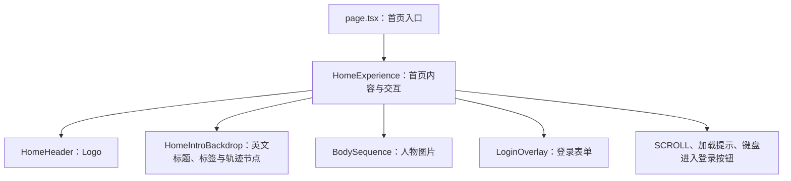

# Formward 代码阅读指南

这份指南帮助你看到文件名和一小段代码，就能判断它负责什么、对应页面上的什么，以及想调整它时该去哪里。阅读时以正在运行的页面为参照，按需要查找相关部分。

内容按当前源码整理，核对日期为 2026 年 10 月 5 日。

- [项目现在有哪些功能](#current-features)
- [页面上的内容对应哪些代码](#page-map)
- [外观和动画在哪里控制](#appearance-motion)
- [配置文件和工具做什么](#tools)
- [登录和数据如何连接](#login-data)
- [想调整什么，应该找哪里](#change-guide)

<a id="current-features"></a>

## 1. 项目现在有哪些功能

| 你能看到或使用的内容 | 当前作用 |
| --- | --- |
| 首页人物与 SCROLL 提示 | 引导用户向下滚动，人物转身后出现登录表单 |
| 封面的 Discipline、Drive、Effortless 和微小标签 | Newsreader 概念词衔接雕塑与产品 UI，表达自律、自驱力与 AI 记录；桌面沿空间轨道转动，登录后停在终点，手机保留底部排布 |
| Email、Password 与 ENTER | 输入账号，提交登录，显示认证进度或错误提示 |
| 人物随鼠标轻微移动 | 桌面首页的视觉反馈；开始填写后人物回到中间并保持固定 |
| 登录后的 `/dashboard` | 显示当前账号、退出按钮；有测量数据时显示最新空腹摘要、主趋势、最近记录与历史抽屉，无数据时显示简短空状态 |
| 数据库与内部账号工具 | 保存账号和登录会话，供管理员创建内部账号 |

身体测量支持三列 TSV（兼容旧四列）预览、维护脚本导入、账号隔离查询与回看。维护脚本支持条件修正与软删除／恢复；四项录入、历史编辑、逐项估算与漏记日期补记已实现，从日期行查看或录入／补录／编辑进入；网页归属纠正、删除／恢复、饮食、运动、通用 Excel 导入和正式 AI API 尚未实现。详细进度见 [项目当前状态](status.md)。

<a id="page-map"></a>

## 2. 页面上的内容对应哪些代码

### 先认识“页面”“路由”和“组件”

**页面**是访问某个网址时看到的完整内容。例如 `/` 显示人物和登录体验，`/dashboard` 显示登录后的主页。

**路由**是“网址路径对应哪个代码入口”的规则。`http://localhost:3000/dashboard` 中的 `/dashboard` 就是路径；Next.js 根据项目目录找到对应的页面文件。

| 访问路径 | 页面入口 | 显示什么 |
| --- | --- | --- |
| `/` | [src/app/page.tsx](../src/app/page.tsx) | 首页人物、提示和登录表单 |
| `/dashboard` | [src/app/dashboard/page.tsx](../src/app/dashboard/page.tsx) | 验证登录后查询自己的测量并显示身体记录；无记录时显示简短空状态 |

**组件**是用代码组织的一块界面，可以包含文字、图片、输入框和交互。例如 `LoginOverlay` 就是整块登录表单，里面有邮箱框、密码框、ENTER 和错误提示；`HomeHeader` 是 Logo 那一块；`HomeExperience` 则组织整个首页。

看到 `<LoginOverlay ... />`，先理解为“这里显示登录表单”。它的具体颜色和位置需要结合样式文件查看。

### `layout.tsx`：页面共用的文档结构和配置

[打开 layout.tsx](../src/app/layout.tsx)。它目前负责三件事：加载 `globals.css`、提供默认浏览器标签标题和页面描述、把当前页面内容放进 HTML 文档。

源码中的这一段，是判断标题用途的线索：

```tsx
export const metadata: Metadata = {
  title: "Formward · 登录",
  description: "在 Formward 记录和回看饮食、训练与身体指标。",
};
```

`title` 对应浏览器标签页上的文字，页面正文由具体页面组件提供。`/dashboard` 在自己的页面文件中设置了 `Formward · 主页`，会使用该标题。

文档结构的关键摘录是：

```tsx
<html lang="zh-CN">
  <body>{children}</body>
</html>
```

这里的“共用结构”具体指：每个页面都放在同一套 `<html>`、`<body>` 标签中，声明主要语言为中文，并在 `body` 中显示当前页面。HTML 是浏览器描述网页内容与结构的格式；`children` 就是 Next.js 放进来的当前页面内容。

访问 `/` 时放入首页，访问 `/dashboard` 时放入主页。这是文档层面的共用关系；人物大小、Logo 离屏幕边缘多远、登录框放在哪里，由相关 CSS 规则控制。

**什么时候看它：**改默认标签页标题、页面描述、网站语言，或增加各页面都要显示的导航。当前 Logo 和登录表单分别写在页面组件中，根布局没有共用导航栏。

### `page.tsx`：让 `/` 显示首页体验

根目录的页面入口很短：

```tsx
import HomeExperience from "./home-experience";

export default function HomePage() {
  return <HomeExperience />;
}
```

这段代码的作用是：用户打开 `/` 时，让页面显示 `HomeExperience` 提供的内容。入口文件只需要说明首页使用哪块界面，具体内容放在对应组件中。

**什么时候看它：**确认首页入口，或决定首页改用哪个界面组件。调整现有人物、表单和交互时，继续看 `home-experience.tsx` 及它使用的文件。

### `HomeExperience`：把首页内容和操作串起来

[打开 home-experience.tsx](../src/app/home-experience.tsx)。它既安排首页包含哪些界面，也协调它们什么时候显示、什么时候可操作。



例如，一次下滚后需要同时发生“人物转身、SCROLL 隐藏、登录框出现”；点击 ENTER 后需要“暂时禁止重复提交、显示验证进度、根据结果播放动画或显示错误”。这些协调工作在这里。

| 在代码里看到的名字 | 代表的工作 | 什么时候需要看 |
| --- | --- | --- |
| `phase` | 当前处于首屏、转身、等待输入、认证或最终过渡中的哪个阶段 | 某个阶段的显示或按钮状态不对 |
| `requestDirection` | 接收正放或倒放的选择 | 滚动后该向哪个方向播放 |
| `enter` | 发起登录并根据认证结果决定下一步 | 验证中、失败重试、成功后的行为 |
| `finishTransition` | 最终动画结束后进入 `/dashboard` | 登录成功后何时跳转 |
| `focusInput` | 开始填写时让人物回中并保持固定 | 输入时人物是否继续移动 |

**修改影响：**这类改动可能同时影响人物、表单和页面跳转，需要连着检查一次完整登录流程。

### Logo、背景标题、人物和表单各自在哪里

| 文件与组件 | 负责什么、识别线索 | 修改会影响什么 |
| --- | --- | --- |
| [home-header.tsx](../src/app/home-header.tsx) 中的 `HomeHeader` | 显示 `formward` 和圆点；搜索 `formward` | 首页 Logo 的文字与内容；字号和位置另看 CSS |
| [home-intro-backdrop.tsx](../src/app/home-intro-backdrop.tsx) 中的 `HomeIntroBackdrop` | 显示三组单行主词与 NUTRITION / BUILD YOURSELF / AI LOGGING 标签，提供静态交叠场景 | 文案看 `principles`，投影与移动看 `home-orbit.ts`，字号及最终淡出看 CSS |
| [home-orbit.ts](../src/app/home-orbit.ts) | 用人物进度计算倾斜轨道、节点、上方引线、下方文字、镜像对齐和远近明暗 | `ORBIT_TURN_DEGREES` 为 150；`orbitPose` 管空间投影，`createOrbitRenderer` 缓存完整标注尺寸，连续插值对齐并更新 DOM，最后清理 |
| [hero-font.ts](../src/app/hero-font.ts) | 加载本地 Newsreader 概念词和 IBM Plex Mono 微标签及 SCROLL | Logo 与产品 UI 保持系统 sans serif；本地字体资源、来源与许可证在 `public/fonts/` |
| [body-sequence.tsx](../src/app/body-sequence.tsx) 中的 `BodySequence` | 准备静态首尾、视频 Canvas 和独立最终图；搜索 `PRE_LOGIN_FRAMES`、`FINAL_FRAME` | 人物图片的显示结构；素材配置另看 `frame-config.ts` |
| [login-overlay.tsx](../src/app/login-overlay.tsx) 中的 `LoginOverlay` | 邮箱框、密码框、ENTER、验证进度和错误提示；搜索 `Email`、`Password`、`VERIFYING…` | 表单内容、输入和提交行为；外观另看 CSS |

SCROLL 文字、动画加载提示和“进入登录”的键盘按钮直接写在 `home-experience.tsx` 中，可搜索它们显示的文字。

<a id="appearance-motion"></a>

## 3. 外观和动画在哪里控制

### “样式”和“布局”具体指什么

样式包含你肉眼看到的颜色、字体、字号、尺寸、位置、间距、背景和视觉效果。例如“ENTER 是金色文字”“邮箱输入框聚焦时才显现底线”“人物在屏幕中间”都属于外观规则。

布局说的是元素的位置和排列，例如 Logo 在左上方、人物居中、登录框在人物尾部前方、邮箱框在密码框上方。当前这些规则主要写在 [globals.css](../src/app/globals.css)。

CSS 文件也包含动画的视觉效果，例如登录成功后人物缩放和变清晰；是否开始播放以及播放进度，还会由交互代码决定。

### `globals.css` 中的“全局”影响哪些东西

根布局加载这个文件，所以其中的规则可以在全站使用。具体影响范围取决于规则选择了哪些元素：

| 你想找的外观 | 在 CSS 中搜索 | 当前作用与修改影响 |
| --- | --- | --- |
| 默认字体和文字颜色 | `body`、`font-family`、`--warm-white` | 默认使用 Avenir Next、Segoe UI、苹方等可用字体；会影响沿用默认设置的文字 |
| 多处共用的金色 | `--gold` | `#bea478`，用于 Logo 圆点、ENTER 和轨迹等引用它的元素；改这里会一起变色 |
| Hero 文字与轨道颜色 | `--hero-ink`、`--hero-label`、`--hero-track` | `#d0c8ba` 暖灰白概念词；`#aa9574` 哑金微标签与滚动提示；`#77664d` 棕金轨道 |
| 页面深色底色 | `--graphite` | `#10100f`，供页面背景使用 |
| 人物背后的暖光 | `.home-stage`、`radial-gradient` | 控制首页光区的位置、范围和强弱 |
| 封面英文排版与轨迹 | `.home-orbit-scene`、`.home-principle`、`.home-principle-detail`、`.home-orbit-node` | 控制两级文字、空间场景静态交叠、细引线和手机底部轴线；空间坐标由 `home-orbit.ts` 计算 |
| Logo 的位置与字号 | `.home-header`、`.home-logo` | 前者控制位置和边距，后者控制字号、粗细等 |
| 人物整体大小 | `.body-frame img` | 控制图片显示高度，影响全部人物帧 |
| 登录框位置与宽度 | `.login-overlay` | 控制整块表单放在哪里、有多宽 |
| 输入框文字与底线 | `.login-form input`、`:hover:not(:disabled)`、`:focus:not(:disabled)` | 底线默认透明，悬停或聚焦时显现；保留 1px 占位与键盘焦点框，尺寸不改变 |
| ENTER 字号与短下划线 | `.login-form button`、`.login-form button::after` | 控制提交按钮的文字和装饰线 |
| SCROLL 的位置与外观 | `.scroll-hint`、`.scroll-hint-track` | 控制左下角提示文字、细轨道及动标，左边距为 7% |

这里 `.home-logo`、`.login-overlay` 等是样式规则的名称。在界面代码中看到 `className="login-overlay"`，就可以去 CSS 搜索 `.login-overlay`，找到这块登录表单的外观设置。

一个代码识别例子：当前 CSS 的 `.login-overlay` 中有 `top: 64%`。它设置桌面基础规则下登录框的竖向位置，增大会让整块表单下移。这里影响的是表单，人物位置有自己的规则。

CSS 中以 `@media` 开头的部分为不同屏幕或系统偏好提供调整。例如手机基础规则下登录框是 `top: 67%`，屏幕高度很小时还有其他设置。改一个位置后，需要分别看电脑、手机和横屏效果。

### 图片的内容、大小和对齐分在哪里

| 想理解或调整什么 | 对应位置 | 识别线索与影响 |
| --- | --- | --- |
| 人物本身的姿态、轮廓和清晰度 | [public/images](../public/images/README.md) 中的 PNG | `1.png`、`12.png` 用于静态停留，`13.png` 用于最终画面；转身内容来自 `public/videos/` |
| 转身视频与黑底透明化 | [turn-video.ts](../src/app/turn-video.ts)、[公开视频](../public/videos/README.md) | 寻帧、端点校准和 Canvas 合成；更换素材后检查两端衔接 |
| 哪些静态图片参与显示 | [frame-config.ts](../src/app/frame-config.ts) | `PRE_LOGIN_FRAMES` 和 `FINAL_FRAME`；改动会影响播放素材 |
| 某一张图与其他图的位置或大小不一致 | 同一文件的 `FRAME_CONFIG` | 每张图有 `desktop`、`mobile` 配置，`scale` 表示缩放，`x`、`y` 表示位置修正 |
| 所有人物图一起放大或缩小 | `globals.css` 的 `.body-frame img`、`.body-frame canvas` | 改显示高度，并核对人物与轨迹文字、左下角提示是否相互遮挡 |

逐张对齐是为了减少换图时头部和躯干跳动。具体测量数据见 [首页人物校准](frame-calibration.md)。

### 播放速度、触发操作和鼠标移动分别在哪里

| 文件 | 负责什么 | 代码识别线索 | 修改影响 |
| --- | --- | --- | --- |
| [home-timeline.ts](../src/app/home-timeline.ts) | 转身播放时间、视频与静态端点混合及表单出现进度 | `PRE_LOGIN_DURATION_MS` 当前为 500 毫秒；`loginReveal` 控制末段表单出现，轨道直接读取同一游标 | 正放、倒放的节奏、文字同步与表单显现时机 |
| [use-direction-trigger.ts](../src/app/use-direction-trigger.ts) | 判断滚轮、触摸和键盘是在要求正放还是倒放 | `WHEEL_THRESHOLD_PX`、`TOUCH_THRESHOLD_PX` | 操作多大幅度才触发播放 |
| [figure-motion.ts](../src/app/figure-motion.ts) | 人物随鼠标轻微移动、倾转和停止后的回中 | `createFigureMotion`、`RETURN_DURATION_MS` | 鼠标反馈幅度和回稳速度 |
| `home-experience.tsx` | 按当前阶段启动、暂停上述行为 | `updateMotion`、`requestDirection`、`enter` | 播放、填写和认证之间如何衔接 |

滚轮在这里用来选择播放方向，达到触发条件后动画会自行播放。触发阈值控制“多容易开始”，播放时长控制“开始后多快完成”。

转身总时长控制播放速度，当前一秒源视频按 2 倍速在 500 毫秒内完成，代码中对应 `PRE_LOGIN_DURATION_MS`，视频帧率与帧数位于 `turn-video.ts`。登录成功后的 12 → 13 过渡另用 `FINAL_DURATION_MS`，当前为 700 毫秒；它与滚动转身是两段不同动画。

<a id="tools"></a>

## 4. 配置文件和工具做什么

React 组织界面组件；TypeScript 描述数据类型并帮助检查代码；Next.js 根据网址选择页面、组织服务器入口和构建；Node.js 运行开发工具及服务器代码。浏览器接收构建后的界面代码并处理交互。

| 文件 | 负责什么 | 识别线索与实际例子 | 什么时候需要看 |
| --- | --- | --- | --- |
| [package.json](../package.json) | 依赖清单和命令入口 | `scripts.dev` 定义 `pnpm dev`；`dependencies` 列出 Next.js、React、认证和数据库库 | 启动、构建、测试，或增加依赖 |
| [next.config.ts](../next.config.ts) | Next.js 框架配置 | 当前 `allowedDevOrigins` 允许 `127.0.0.1` 请求开发资源 | 换用其他开发转发域名时；修改后重启开发服务 |
| [tsconfig.json](../tsconfig.json) | TypeScript 检查与导入路径规则 | `strict` 开启严格检查；`@/*` 对应 `src/*`，如 `@/features/auth/client` | 理解编辑器类型报错或导入路径 |
| [postcss.config.mjs](../postcss.config.mjs) | 将 Tailwind CSS 接到样式处理流程 | `@tailwindcss/postcss` | 调整样式工具接入方式 |
| [eslint.config.mjs](../eslint.config.mjs) | 代码检查规则 | `pnpm lint` 使用它 | 理解代码规范检查的结果 |

当前 `pnpm dev`、`pnpm build` 明确使用 Webpack；`pnpm test` 使用 Node.js 内置测试运行器。项目声明使用哪些依赖、提供哪些命令，以 `package.json` 为准。

认识后缀也能帮助判断文件用途：`.tsx` 通常描述界面；`.ts` 常写配置或处理逻辑；`.css` 写外观；`.mts` 是这里的 TypeScript 维护或测试脚本；`.md` 是说明文档。

`node_modules` 保存安装的第三方依赖，`.next` 保存生成的开发和构建内容。修改功能时，从项目源码和配置文件找入口。

<a id="login-data"></a>

## 5. 登录和数据如何连接

### 浏览器和服务器各负责哪一段

浏览器负责显示输入框、收集本次输入、显示验证进度和播放动画。这里的服务器端是运行 Next.js 应用、处理浏览器请求的代码，它调用认证功能并访问数据库。

**API**是通过网址接收请求并返回结果的入口。例如登录表单向 `/api/auth/sign-in/email` 发送邮箱和密码，服务器返回登录是否成功。

一次成功登录按这个顺序发生：

1. `LoginOverlay` 收集邮箱和密码，把提交交给 `HomeExperience`。
2. `HomeExperience` 暂停方向操作和重复提交，调用认证客户端发送请求。
3. 服务器的认证 API 把请求交给 Better Auth，查询账号并验证密码。
4. 验证通过后建立登录会话，并让浏览器保存相应 cookie。
5. 首页播放 12 → 13 的最终动画，动画结束后进入 `/dashboard`。
6. 主页在服务器上验证这次访问的会话，再显示对应账号。

**会话**是服务器保存的“某次登录当前仍然有效”的记录。**cookie**是浏览器保存并随请求带回网站的信息，帮助服务器找到并验证对应会话。因此刷新页面后仍可以保持登录。

验证失败时，首页保留表单并显示错误，供用户重试。退出登录会撤销自己的会话，并返回首页。

### 沿着流程找对应代码

| 文件 | 负责什么、识别线索 | 修改会影响什么 |
| --- | --- | --- |
| [认证客户端 client.ts](../src/features/auth/client.ts) | 在浏览器发送登录和退出请求；`signIn`、`signOut` | 请求、等待超时和中文错误反馈 |
| [认证 API 的 route.ts](../src/app/api/auth/[...all]/route.ts) | 接收 `/api/auth/` 下的认证请求，交给认证功能；`getAuth().handler` | HTTP 请求入口与服务不可用时的响应 |
| [auth.ts](../src/features/auth/auth.ts) | 配置 Better Auth 并获取当前用户；`createAuth`、`currentUser` | 登录规则、会话期限、允许发起认证请求的网站地址、每分钟允许尝试登录的次数 |
| [server.ts](../src/features/auth/server.ts) | 给服务器页面提供 `getAuth`、`currentUser`；浏览器组件通过认证客户端发送请求 | 页面怎样取得认证功能，并让数据库和密钥相关代码留在服务器端 |
| [主页 page.tsx](../src/app/dashboard/page.tsx) | 先验证用户，再显示主页；`currentUser`、`redirect` | 未登录时的跳转、账号和主页内容 |
| [logout-button.tsx](../src/app/dashboard/logout-button.tsx) | 显示退出按钮并调用 `signOut` | 退出进度、失败提示和成功后的返回 |

### 数据库相关名字分别代表什么

PostgreSQL 是保存记录的数据库，Neon 提供托管 PostgreSQL 的服务。`postgres` 库负责连接和发送查询，Drizzle 帮助代码描述表并组织查询，Better Auth 使用这些能力保存和验证账号。

| 文件或位置 | 保存或处理什么 | 什么时候需要看 |
| --- | --- | --- |
| [src/db/client.ts](../src/db/client.ts) | 从 `DATABASE_URL` 取得地址，复用数据库连接池，并将 Node 的单地址连接尝试时限设为至少 1 秒 | 网站连接哪一个数据库、连接为什么失败 |
| [src/db/schema.ts](../src/db/schema.ts) | 描述表有哪些字段和关联 | 理解账号与会话存在哪些表 |
| [drizzle](../drizzle/README.md) | 保存数据库结构变更文件，称为 migration | 新增表或字段时，将结构变化应用到数据库 |
| [provision.ts](../src/features/auth/provision.ts) | 校验输入并创建内部账号；`provisionAccount` | 账号创建规则与重复创建的处理 |
| [create-account.mts](../scripts/create-account.mts) | 在终端询问邮箱和密码，调用账号创建功能 | 管理员创建内部账号 |

当前认证有四张表：`users` 保存用户身份，`accounts` 保存登录方式及密码哈希，`sessions` 保存登录会话，`verifications` 为临时验证记录提供表结构。密码哈希是用于核验密码的不可逆结果，数据库保存这个结果；登录时验证本次输入是否匹配。

`schema.ts` 描述目标表结构，migration 记录结构变化，真实账号和会话保存在连接地址指向的数据库中。`pnpm db:generate` 生成结构变更文件，`pnpm db:migrate` 才将这些变更应用到目标数据库。已有共享环境执行过的 migration 保留原样，后续结构变化创建新的文件。

`.env.local` 保存本机私有配置：`DATABASE_URL` 指向数据库，`BETTER_AUTH_URL` 指向网站，`BETTER_AUTH_SECRET` 是应用认证密钥。网站开发资源来源和认证可信来源各有配置；换访问域名时也要核对认证设置。填写、建表和账号创建的具体操作见 [数据库与账号接入](auth-setup.md)。

<a id="change-guide"></a>

## 6. 想调整什么，应该找哪里

### 参数与修改位置速查

| 想调整什么 | 先找哪里、搜索什么 | 改后看什么 |
| --- | --- | --- |
| 浏览器标签标题 | `layout.tsx` 的 `metadata.title`；主页标题看 `dashboard/page.tsx` | 首页与主页各自的标签文字 |
| 默认字体 | `globals.css` 的 `body`、`font-family` | Logo、表单和主页文字是否合适；首页概念词单独使用 Newsreader |
| 首页概念词字体与字号 | `hero-font.ts`、`.home-principle`、`--hero-title-size` | Newsreader 正体 400、自动光学尺寸、0.035em 字距；桌面 20–26px，手机 14px；三个主词均为单行同级 |
| Logo 字号 | `globals.css` 的 `.home-logo` | 桌面与手机大小；主页 Logo 另看 `.dashboard-logo` |
| 首页 Logo 文字 | `home-header.tsx` 的 `formward` | 首页文字；主页有自己的 Logo 内容 |
| 金色元素的颜色 | `globals.css` 的 `--gold`、`--hero-label` | 前者影响 Logo 圆点、ENTER 和主页；后者影响 Hero 微标签与 SCROLL |
| 把登录框往下移 | `globals.css` 的 `.login-overlay`、`top` | 电脑、手机、横屏是否遮住人物或超出画面 |
| Email、Password、ENTER 等文案 | `login-overlay.tsx` 中对应文字 | 默认、验证中、错误三种显示情况 |
| 人物整体大小 | `globals.css` 的 `.body-frame img`、`.body-frame canvas` | 人物是否被裁切，轨迹文字和 SCROLL 是否与人物重叠 |
| 只修正某张人物图的位置 | `frame-config.ts` 中对应图片的 `FRAME_CONFIG` | 正放、倒放时头顶和躯干是否跳动 |
| 转身播放速度 | `home-timeline.ts` 的 `PRE_LOGIN_DURATION_MS` | 正放、倒放、中途反向、轨道同步及表单出现时机 |
| 文字轨道与旋转角度 | `home-orbit.ts` 的 `ORBIT_TURN_DEGREES` 和投影参数 | 终点方位、远近层次、引线连接以及四种视口中的可读性 |
| 多大滚动幅度才开始转身 | `use-direction-trigger.ts` 的 `WHEEL_THRESHOLD_PX` | 小幅滚动、明确滚动和反向操作 |
| 鼠标联动和回中速度 | `figure-motion.ts` 的 `move`、`RETURN_DURATION_MS` | 移动、停止、移出页面和开始输入 |
| 登录成功后何时跳转 | `home-experience.tsx` 的 `finishTransition` | 动画完成后才进入主页，失败时保留表单 |
| 主页模块和文字 | `dashboard/page.tsx` | 登录后的内容、手机排列和退出按钮 |
| 账号登录和会话规则 | `src/features/auth/auth.ts` | 正常、无效、重复操作及跨账号场景 |

### 修改后怎样确认

先明确预期，例如“只把登录框下移，人物保持原位置”。改完在实际页面上对照这个预期，再检查相关场景。

| 检查入口 | 能确认什么 | 使用场景 |
| --- | --- | --- |
| `pnpm lint` | 代码是否符合配置的检查规则 | 修改源码 |
| `pnpm typecheck` | 类型和调用关系是否符合约定 | 修改 TypeScript 或组件参数 |
| `pnpm test` | 动画和认证的自动化行为检查 | 修改对应逻辑 |
| `pnpm build` | 能否完成生产构建 | 修改源码、依赖或配置 |
| `pnpm test:browser` | 实际浏览器中的登录、动画结束和跳转 | 修改认证或登录交互；需先准备浏览器环境并完成构建 |

外观改动还要查看电脑、手机、窄屏和横屏。完整首页视觉检查需设置 `FORMWARD_VISUAL_CHECK=1`，运行条件和覆盖范围见 [测试说明](../tests/README.md)。数据库与认证检查使用独立测试环境和虚构账号。

只调整说明文档时，检查文件链接、目录导航、例子与源码是否一致。

### 需要更多细节时去哪里

| 想查什么 | 对应说明 |
| --- | --- |
| 如何安装和启动 | [根 README](../README.md) |
| 页面应该呈现什么行为 | [页面方案](interface.md) |
| 人物各帧的测量和对齐数据 | [首页人物校准](frame-calibration.md) |
| 配置数据库、建表、创建账号 | [数据库与账号接入](auth-setup.md) |
| 页面、业务和数据库代码如何分工 | [轻量架构](architecture.md) |
| 后续健康记录的归属、来源和单位要求 | [数据模型](data-model.md) |
| 当前实现和待办 | [项目当前状态](status.md) |

## 身体记录的日期与维护

`src/features/measurements/calendar.ts` 负责日历运算、最早起点与分批日期生成；`trend.ts` 使用日历区间、正常纵轴、稀疏刻度及晨晚连线，`days.ts` 统一候选选择、真实配对和最近 10 个日历日，`summary.ts` 分别计算两个指标的最新实测空腹值与 7 日首末差／均值。`measurements-view.tsx` 同时呈现六项摘要与双图，共用日期、晚间、估计和规则入口；五列表格晨晚各两行数值，直接点击进入对应指标与记录。完整历史每批 50 日期可继续加载和补记，空行只在展示时推导，不写库或自动估算。统一 Inspector 320ms 滑入、240ms 退出，全部关闭方式等动画完成后恢复滚动和焦点，减少动态效果设置下直接开关。`estimation.ts` 正常模式只用此前真实依据，`initialization.ts` 保存独立历史初始化及冻结，`estimate-records.ts` 仅替代实际补录指标；`completion.ts` 跳过冻结日期、`rebuild.ts` 禁止重建冻结范围。估计依据读取保存快照，维护入口见 `scripts/README.md`。

`sources.ts` 保存账号历史来源并在成功实测事务中更新使用时间；`source-input.tsx` 支持自由输入和鼠标／触控／键盘建议，`device_label` 保存独立名称快照。完整物理字段与索引见 [数据库字典](database.md)。

`editing.ts` 提供当天部分写入、带版本的历史编辑与逐项估算，晨间严格要求空腹，旧非空腹／未知记录只读；内部兼容函数仍支持既有日期与提醒状态。`entry-state.ts` 是浏览器可用的四格状态与缺项判断；`measurement-entry.tsx` 是统一 Inspector 中的四格表单，页面无独立今日入口、跳过按钮或自动弹窗。`src/app/dashboard/actions.ts` 仅暴露保存与估算，验证当前会话后调用 feature，返回账号最新快照并刷新页面。普通写入、编辑、导入或恢复都不自动估算，只有明确按钮或维护任务生成估计；有草稿时估算禁用，已保存晨间加典型差得到晚间，双缺测时内部拟合晨间后加典型差，只保存点击的指标。后补晨间实测不会自动改写已有晚间估计；实测按指标替代，其他估计依据保持。修改此流程应检查任意四项子集、仅体脂、空腹与旧条件只读、估算顺序、冻结历史、版本冲突、并发重复、跨账号和回滚。

`records.ts` 在统一校验中将晚间标为非空腹，白天空腹仍须确认。`maintenance.ts` 与 `scripts/maintain-measurements.mts` 提供绑定账号快照的历史修正、保留较早候选与软删除／恢复，事件保存前后快照及操作者。维护主动运行，不在读取或导入时暗改历史。

`pnpm test:measurements-browser` 复用隔离数据库的 HTTP 测试服务，验证正文居中、六项摘要、双图筛选和独立纵轴、五列对齐、日历空行与 50 日历史加载、查看与状态操作、空腹规则、候选一致性、自然页面长度、手机触控与 Inspector 逐帧动效和焦点；环境与截图复现见 `tests/README.md`。
