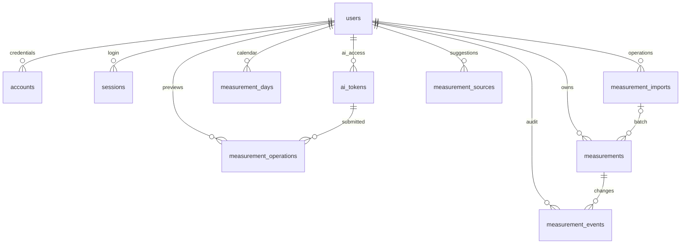

# 数据库连接与字段字典

本文描述已纳入 migration 的当前物理结构。业务语义见 [数据模型原则](data-model.md)，认证配置见 [接入指南](auth-setup.md)。不包含真实健康数值、账号或连接凭据。当前有 11 张业务／认证表；`measurements` 为 30 列，`measurement_sources` 为 4 列。

`0007_strong_omega_sentinel.sql` 将测量与日期表统一为 `record_date`，测量表移除重复 `local_date`。实际发生日期从 `source_local_time` 读取；迁移在删除旧列前锁定并验证两者一致，异常则整批停止。凌晨分组、已有指纹、原始输入、旧审计和冻结报告保持。旧私有请求只在读取入口兼容 `analysisDate`；新模型统一使用 `recordDate`，冲突拒绝，旧补全请求指纹仍可识别。

## 连接与演进流程

1. 使用 Node.js 24 和 pnpm 9，安装依赖。把数据库运行连接配置到私有 `.env.local` 的 `DATABASE_URL`；需要直连的 migration 使用 `DATABASE_MIGRATION_URL`，未设置则使用运行连接。Neon 与本机 PostgreSQL 共用 postgres.js／Drizzle。配置不提交 Git、不打印 URL。
2. 在现有数据库上执行结构变更前，运行 `node --env-file=.env.local --import tsx scripts/backup-database.mts data/exports/私有备份.json`。工具在 repeatable read 只读事务中导出 public 和 drizzle 表及字段信息，文件以 0600 创建、拒绝覆盖。备份包括认证数据，保持私有；恢复先还原对应版本结构，再按外键顺序恢复数据和 migration journal，切勿对正式库盲目重放。
3. 修改 `src/db/schema.ts`，执行 `pnpm db:generate`，审阅新 SQL 与快照。已经共享的 migration 不修改；数据转换必须在删列之前完成。生成文件纳入版本控制后，运行 `pnpm db:migrate`。
4. 应用通过 `getDatabase()` 复用服务端连接池，页面与 Server Action 从当前会话获得账号，再调用 feature。查询按账号顺序执行以兼容 PGlite；所有测量写入锁定 users 中的归属账号并在事务内保存批次、事实、来源建议和审计。
5. 需要人工查看数据库时，用支持 PostgreSQL 的私有 SQL 客户端导入同一环境连接，按 `user_id` 限定查询；不要将完整连接地址写入文档、终端历史或公共截图。只读排查不直接改结构，结构变化只走 migration。

`0006_living_tarantula.sql` 合并已知设备和应用为 `device_label`，在删旧列前保存来源合并审计；设备或应用只有一项时保留该项。移除 BMI 数值列与检查约束，但不改旧去重键、原始输入、审计、初始化依据、日期与提醒状态。当前账号未知来源实测的授权补齐由 `fill-measurement-sources.mts` 调用 feature 完成；不在 migration 中硬编码账号或给其他账号猜来源。估计不保存设备来源。旧四列 TSV 的 BMI 仅留在原文件；三列格式为测量时间、体重、体脂率。重导用原始时间、时区、偏移与原始体重／体脂核对，人工编辑或软删除后仍跳过原记录。

## 逻辑关系

`verifications` 按验证对象 identifier 管理，未设用户外键。`measurement_sources` 不是记录的外键：测量保存 label 文本快照，修改某条记录来源不会改其他历史记录。`created_by`、`actor_id` 等操作者快照保留文本标识，不是数据归属外键；真正归属由 `user_id` 校验。体重单位固定 kg，体脂固定 %；外部原值、来源标识和批次状态独立保存。

## 物理字段

以下类型来自 Drizzle 快照。非空字段的“无空值”表示数据库拒绝 NULL，不代表 feature 接受任意内容。timestamp 均带时区。未知业务数值使用 NULL；JSON 快照及审计保持原始内容。AI 令牌保存在 ai_tokens，只保存不可逆摘要，不能复用网页登录会话令牌。

### `ai_tokens`

由 `0008_aspiring_thunderbolt_ross.sql` 创建；完整令牌仅生成时返回，不持久保存。

| 字段 | 类型 | 含义 |
| --- | --- | --- |
| id | text PK | 令牌 ID |
| user_id | text FK | 所属账号，关联 users |
| name | text | 用户填写的名称 |
| token_hash | text UNIQUE | 随机令牌的 SHA-256 摘要 |
| prefix | text | 列表显示前缀，不用于鉴权 |
| permission | text | read／write，数据库 check；write 包含查询与提交预览 |
| created_at | timestamptz | 创建时间 |
| expires_at | timestamptz | 30 天到期 |
| last_used_at | timestamptz nullable | 最近有效使用时间 |
| revoked_at | timestamptz nullable | 撤销时间，鉴权即时检查 |

user_id 有索引，令牌只通过完整随机原文摘要查找并映射账号。创建／撤销锁定所属 users，与确认操作串行。

### `measurement_operations`

由 0008 创建，0009 增加审核版本和混合状态，记录待确认内容，不是实测事实。

| 字段 | 类型 | 含义 |
| --- | --- | --- |
| id | text PK | 操作 ID，用于状态与网页链接 |
| user_id | text FK | 所属账号 |
| token_id | text FK | 发起令牌，关联 ai_tokens |
| operation_id | text | 客户端稳定请求 ID，按账号唯一 |
| request_digest | text | 规范化请求摘要，重试须同内容和令牌 |
| snapshot_digest | text | 身体记录及初始化冻结依据快照摘要 |
| payload | jsonb | 不可变的批量／兼容单日／单项原始请求，幂等摘要绑定此内容 |
| preview | jsonb | 前后值、冲突、估算依据；items 内保存稳定行 ID、原始内容、当前草稿、编辑者与逐行状态／结果 |
| revision | integer | 默认 1，网页修改／刷新／确认／取消递增，拒绝旧版本覆盖 |
| status | text | pending／partially_confirmed／confirmed／completed／cancelled，数据库 check |
| result | jsonb nullable | 确认后的消息与保存数量 |
| created_at | timestamptz | 预览创建时间 |
| expires_at | timestamptz | 15 分钟到期，更新／刷新续期；尚有待处理行时由读取推导 expired |
| confirmed_at | timestamptz nullable | 最近一次行保存的网页确认时间 |

(user_id, operation_id) 唯一，(user_id, created_at) 索引用于最近提交。读取、修改、取消和确认校验归属；修改／刷新／确认复核令牌有效性，确认另复核快照、有效期和审核版本。单行确认立即写入，整批确认同一事务；取消不撤销已保存行。AI 审计保存在 measurement_events.snapshot.ai，包含 tokenId、operationId（此表 id）、confirmedBy、confirmedAt；可编辑审核另保存 review 的行 ID、审核版本、originalInput、reviewedInput 与 editedBy。旧单日／单项 JSON 使用兼容适配，不改原 payload。0009 不改健康表与已有健康数据。

### `accounts`

| 字段 | 类型 | 空值／默认值 | 用途 | 维护入口 |
| --- | --- | --- | --- | --- |
| `id` | `text` | 无空值 | 稳定记录标识 | `认证 feature／measurements feature 创建` |
| `user_id` | `text` | 无空值 | 所属账号；读写必须用已验证身份限定 | `认证／measurements feature` |
| `account_id` | `text` | 无空值 | 提供方的账号标识；内部凭据由认证管理 | `Better Auth` |
| `provider_id` | `text` | 无空值 | 登录提供方标识 | `Better Auth` |
| `password` | `text` | 可空：未提供／不适用，具体见用途 | 安全密码哈希；空值表示无密码凭据 | `auth/provision.ts／Better Auth` |
| `access_token` | `text` | 可空：未提供／不适用，具体见用途 | OAuth 授权令牌；未启用 OAuth 时为空，不是 AI Token | `Better Auth` |
| `refresh_token` | `text` | 可空：未提供／不适用，具体见用途 | OAuth 刷新令牌；未启用时为空 | `Better Auth` |
| `id_token` | `text` | 可空：未提供／不适用，具体见用途 | OAuth 身份令牌；未启用时为空 | `Better Auth` |
| `access_token_expires_at` | `timestamp with time zone` | 可空：未提供／不适用，具体见用途 | OAuth 访问授权到期时间；空值表示无授权 | `Better Auth` |
| `refresh_token_expires_at` | `timestamp with time zone` | 可空：未提供／不适用，具体见用途 | OAuth 刷新授权到期时间；空值表示无授权 | `Better Auth` |
| `scope` | `text` | 可空：未提供／不适用，具体见用途 | OAuth 授权范围；空值表示无授权 | `Better Auth` |
| `created_at` | `timestamp with time zone` | 无空值；默认 now() | 创建时间；不是测量时间 | `创建记录时由数据库／feature 写入` |
| `updated_at` | `timestamp with time zone` | 无空值；默认 now() | 最近修改时间；测量编辑用它作并发版本 | `对应 feature 更新` |

约束与索引：

- 主键：`id`。
- 索引 `accounts_user_id_idx`：`user_id`。
- 唯一索引 `accounts_provider_account_idx`：`provider_id, account_id`。
- 外键 `accounts_user_id_users_id_fk`：`user_id` → `users.id`；删除规则 `cascade`。

### `measurements`

| 字段 | 类型 | 空值／默认值 | 用途 | 维护入口 |
| --- | --- | --- | --- | --- |
| `id` | `text` | 无空值 | 稳定记录标识 | `认证 feature／measurements feature 创建` |
| `user_id` | `text` | 无空值 | 所属账号；读写必须用已验证身份限定 | `认证／measurements feature` |
| `source_local_time` | `text` | 无空值 | 原始当地时间；day_period 只含记录日期，assumed 含占位钟点，均不能当准确时间 | `records.ts／导入／准确时间维护` |
| `occurred_at` | `timestamp with time zone` | 可空：未提供／不适用，具体见用途 | 准确测量的 UTC 时刻；未知时区或占位／日期时段／估计时为空 | `records.ts／time.ts` |
| `timezone` | `text` | 可空：未提供／不适用，具体见用途 | 当次 IANA 时区；空值表示未知，不用当前所在地改旧数据 | `records.ts／time.ts` |
| `utc_offset_minutes` | `integer` | 可空：未提供／不适用，具体见用途 | 当次相对 UTC 的分钟偏移；空值表示没有准确时刻或未知 | `time.ts` |
| `time_precision` | `text` | 无空值；默认 'second' | second 为准确时间；day_period 为日期时段；assumed 为明确授权占位 | `records.ts／估计 feature` |
| `record_date` | `date` | 无空值 | 唯一记录日期，用于日历、晨晚配对和估计；凌晨仍放前一天晚间 | `records.ts／editing.ts／assignment.ts` |
| `period` | `text` | 无空值 | daytime 或 evening；当地凌晨按前日晚间归属 | `assignment.ts／records.ts` |
| `assignment_method` | `text` | 无空值 | 归属方式，例如 clock、user_period、estimated_target | `assignment.ts／records.ts／estimate-records.ts` |
| `assignment_rule_version` | `text` | 无空值 | 归属规则版本，旧记录不自动重分组 | `assignment.ts／records.ts／estimate-records.ts` |
| `fasting` | `boolean` | 可空：未提供／不适用，具体见用途 | 空腹条件；空值表示未确认，不等同非空腹 | `records.ts／授权 maintenance.ts` |
| `fasting_source` | `text` | 可空：未提供／不适用，具体见用途 | 空腹确认依据；空值表示条件未知 | `records.ts／estimate-records.ts／授权 maintenance.ts` |
| `weight_kg` | `numeric(7, 2)` | 可空：未提供／不适用，具体见用途 | 体重 kg；空值表示该指标未知，不能用 0 代替 | `records.ts／editing.ts／estimate-records.ts` |
| `body_fat_percent` | `numeric(5, 2)` | 可空：未提供／不适用，具体见用途 | 体脂百分比；空值表示未知，0 可为已知数值 | `records.ts／editing.ts／estimate-records.ts` |
| `source_type` | `text` | 无空值 | 原始采集方式：import、manual 或 estimate | `records.ts／estimate-records.ts` |
| `record_kind` | `text` | 无空值；默认 'observed' | observed 为实测，estimated 为系统估计 | `records.ts／estimate-records.ts` |
| `entry_channel` | `text` | 可空：未提供／不适用，具体见用途 | api、manual、development_backend；空值表示旧入口未知 | `records.ts；编辑保留原入口` |
| `device_label` | `text` | 可空：未提供／不适用，具体见用途 | 设备与连接应用的合并名称快照；空值表示未知，估计保持为空 | `editing.ts／records.ts／sources.ts／授权来源维护` |
| `estimation` | `jsonb` | 可空：未提供／不适用，具体见用途 | 估计规则、真实依据和样本快照；实测为空 | `estimate-records.ts／initialization.ts／rebuild.ts` |
| `source_system` | `text` | 可空：未提供／不适用，具体见用途 | 真实外部来源系统；空值表示未提供，不能把输入工具当外部同步 | `records.ts／后续连接器` |
| `source_record_id` | `text` | 可空：未提供／不适用，具体见用途 | 外部稳定记录标识；空值表示来源未提供 | `records.ts／后续连接器` |
| `import_id` | `text` | 可空：未提供／不适用，具体见用途 | 导入或操作批次关联；空值表示无批次 | `records.ts／editing.ts／估计 feature` |
| `source_row` | `integer` | 可空：未提供／不适用，具体见用途 | 原文件行号；非文件来源为空 | `imports/measurements.ts／records.ts` |
| `original_values` | `jsonb` | 无空值 | 不可覆盖的原始输入快照；既有 BMI 可留在历史输入中，新增业务输入无 BMI | `records.ts／estimate-records.ts；编辑不改写` |
| `deduplication_key` | `text` | 无空值 | 账号内唯一写入指纹；旧键保持，重导另核对原始时间和体重／体脂 | `records.ts／estimate-records.ts` |
| `created_by` | `text` | 无空值 | 创建操作者标识，与来源真实性分开 | `各写入 feature` |
| `created_at` | `timestamp with time zone` | 无空值；默认 now() | 创建时间；不是测量时间 | `创建记录时由数据库／feature 写入` |
| `updated_at` | `timestamp with time zone` | 无空值；默认 now() | 最近修改时间；测量编辑用它作并发版本 | `对应 feature 更新` |
| `deleted_at` | `timestamp with time zone` | 可空：未提供／不适用，具体见用途 | 软删除时刻；空值表示有效，可由授权维护恢复 | `maintenance.ts／estimate-records.ts／初始化与重建` |

约束与索引：

- 主键：`id`。
- 唯一索引 `measurements_user_dedup_idx`：`user_id, deduplication_key`。
- 唯一索引 `measurements_active_estimate_idx`：`user_id, record_date, period`；条件 `"measurements"."record_kind" = 'estimated' AND "measurements"."deleted_at" IS NULL`。
- 索引 `measurements_user_record_date_idx`：`user_id, record_date`。
- 外键 `measurements_user_id_users_id_fk`：`user_id` → `users.id`；删除规则 `cascade`。
- 外键 `measurements_import_id_measurement_imports_id_fk`：`import_id` → `measurement_imports.id`；删除规则 `no action`。
- 检查 `measurements_weight_valid`：`"measurements"."weight_kg" > 0`。
- 检查 `measurements_metric_presence`：`"measurements"."weight_kg" IS NOT NULL OR "measurements"."body_fat_percent" IS NOT NULL`。
- 检查 `measurements_body_fat_valid`：`"measurements"."body_fat_percent" IS NULL OR "measurements"."body_fat_percent" BETWEEN 0 AND 100`。
- 检查 `measurements_period_valid`：`"measurements"."period" IN ('daytime', 'evening')`。
- 检查 `measurements_instant_has_timezone`：`"measurements"."occurred_at" IS NULL OR "measurements"."timezone" IS NOT NULL`。
- 检查 `measurements_kind_valid`：`"measurements"."record_kind" IN ('observed', 'estimated')`。
- 检查 `measurements_channel_valid`：`"measurements"."entry_channel" IS NULL OR "measurements"."entry_channel" IN ('api', 'manual', 'development_backend')`。
- 检查 `measurements_estimation_valid`：`("measurements"."record_kind" = 'estimated' AND "measurements"."estimation" IS NOT NULL AND "measurements"."occurred_at" IS NULL) OR ("measurements"."record_kind" = 'observed' AND "measurements"."estimation" IS NULL)`。
- 检查 `measurements_assumed_time_valid`：`"measurements"."time_precision" NOT IN ('assumed', 'day_period') OR "measurements"."occurred_at" IS NULL`。

### `measurement_days`

| 字段 | 类型 | 空值／默认值 | 用途 | 维护入口 |
| --- | --- | --- | --- | --- |
| `id` | `text` | 无空值 | 稳定记录标识 | `认证 feature／measurements feature 创建` |
| `user_id` | `text` | 无空值 | 所属账号；读写必须用已验证身份限定 | `认证／measurements feature` |
| `record_date` | `date` | 无空值 | 唯一记录日期，用于日历、晨晚配对和估计；凌晨仍放前一天晚间 | `records.ts／editing.ts／assignment.ts` |
| `reminder_skipped_at` | `timestamp with time zone` | 可空：未提供／不适用，具体见用途 | 既有当天停止提醒时刻；空值表示未停止，当前网页不暴露开关 | `editing.ts 内部兼容函数` |
| `created_by` | `text` | 无空值 | 创建操作者标识，与来源真实性分开 | `各写入 feature` |
| `created_at` | `timestamp with time zone` | 无空值；默认 now() | 创建时间；不是测量时间 | `创建记录时由数据库／feature 写入` |
| `updated_at` | `timestamp with time zone` | 无空值；默认 now() | 最近修改时间；测量编辑用它作并发版本 | `对应 feature 更新` |
| `deleted_at` | `timestamp with time zone` | 可空：未提供／不适用，具体见用途 | 软删除时刻；空值表示有效，可由授权维护恢复 | `maintenance.ts／estimate-records.ts／初始化与重建` |

约束与索引：

- 主键：`id`。
- 唯一索引 `measurement_days_user_date_idx`：`user_id, record_date`。
- 外键 `measurement_days_user_id_users_id_fk`：`user_id` → `users.id`；删除规则 `cascade`。

### `measurement_events`

| 字段 | 类型 | 空值／默认值 | 用途 | 维护入口 |
| --- | --- | --- | --- | --- |
| `id` | `text` | 无空值 | 稳定记录标识 | `认证 feature／measurements feature 创建` |
| `user_id` | `text` | 无空值 | 所属账号；读写必须用已验证身份限定 | `认证／measurements feature` |
| `measurement_id` | `text` | 无空值 | 审计所关联的测量事实 | `各测量写入 feature／来源合并 migration` |
| `action` | `text` | 无空值 | create、import、update、delete、restore、estimate 等事件类型 | `各写入 feature` |
| `actor_type` | `text` | 无空值 | user、ai、development_backend 等操作者类别 | `各写入 feature／来源合并 migration` |
| `actor_id` | `text` | 无空值 | 实际执行者标识 | `各写入 feature／来源合并 migration` |
| `snapshot` | `jsonb` | 无空值 | 不可改写的前后快照、依据和理由；旧 BMI 与拆分设备字段可保留 | `各写入 feature／来源合并 migration` |
| `created_at` | `timestamp with time zone` | 无空值；默认 now() | 创建时间；不是测量时间 | `创建记录时由数据库／feature 写入` |

约束与索引：

- 主键：`id`。
- 索引 `measurement_events_user_record_idx`：`user_id, measurement_id`。
- 外键 `measurement_events_user_id_users_id_fk`：`user_id` → `users.id`；删除规则 `cascade`。
- 外键 `measurement_events_measurement_id_measurements_id_fk`：`measurement_id` → `measurements.id`；删除规则 `no action`。

### `measurement_imports`

| 字段 | 类型 | 空值／默认值 | 用途 | 维护入口 |
| --- | --- | --- | --- | --- |
| `id` | `text` | 无空值 | 稳定记录标识 | `认证 feature／measurements feature 创建` |
| `user_id` | `text` | 无空值 | 所属账号；读写必须用已验证身份限定 | `认证／measurements feature` |
| `file_digest` | `text` | 无空值 | 文件或稳定操作标识摘要，按账号去重 | `records.ts／editing.ts／维护 feature` |
| `source_label` | `text` | 无空值 | 文件名或操作说明；不存原文件内容 | `records.ts／editing.ts／维护 feature` |
| `capture_channel` | `text` | 无空值 | 批次采集或操作入口 | `records.ts／editing.ts／维护 feature` |
| `status` | `text` | 无空值；默认 'completed' | 批次同步／导入状态，当前完成批次为 completed | `records.ts／维护 feature` |
| `inserted_count` | `integer` | 无空值 | 批次新增记录数量 | `records.ts／editing.ts／维护 feature` |
| `skipped_count` | `integer` | 无空值 | 批次跳过数量 | `records.ts／editing.ts／维护 feature` |
| `created_by` | `text` | 无空值 | 创建操作者标识，与来源真实性分开 | `各写入 feature` |
| `created_at` | `timestamp with time zone` | 无空值；默认 now() | 创建时间；不是测量时间 | `创建记录时由数据库／feature 写入` |
| `initialization_metadata` | `jsonb` | 可空：未提供／不适用，具体见用途 | 一次性初始化范围、冻结策略、快照、报告；空值表示普通批次 | `initialization.ts，其他入口只读冻结依据` |
| `request_digest` | `text` | 可空：未提供／不适用，具体见用途 | 请求内容摘要；空值表示旧批次未绑定内容 | `editing.ts` |

约束与索引：

- 主键：`id`。
- 唯一索引 `measurement_imports_user_digest_idx`：`user_id, file_digest`。
- 唯一索引 `measurement_imports_user_initialization_idx`：`user_id`；条件 `"measurement_imports"."initialization_metadata" IS NOT NULL`。
- 外键 `measurement_imports_user_id_users_id_fk`：`user_id` → `users.id`；删除规则 `cascade`。

### `measurement_sources`

| 字段 | 类型 | 空值／默认值 | 用途 | 维护入口 |
| --- | --- | --- | --- | --- |
| `user_id` | `text` | 无空值 | 所属账号；读写必须用已验证身份限定 | `认证／measurements feature` |
| `label` | `text` | 无空值 | 账号内唯一历史来源名称，去首尾空白，长度 1–300；记录保存自己的快照 | `sources.ts，仅实测成功事务写入` |
| `created_at` | `timestamp with time zone` | 无空值；默认 now() | 创建时间；不是测量时间 | `创建记录时由数据库／feature 写入` |
| `last_used_at` | `timestamp with time zone` | 无空值；默认 now() | 最近成功用于实测的时间；草稿、失败和估计不更新 | `sources.ts` |

约束与索引：

- 唯一索引 `measurement_sources_user_label_idx`：`user_id, label`。
- 索引 `measurement_sources_user_last_used_idx`：`user_id, last_used_at`。
- 外键 `measurement_sources_user_id_users_id_fk`：`user_id` → `users.id`；删除规则 `cascade`。
- 检查 `measurement_sources_label_valid`：`length("measurement_sources"."label") BETWEEN 1 AND 300 AND "measurement_sources"."label" = btrim("measurement_sources"."label")`。

### `sessions`

| 字段 | 类型 | 空值／默认值 | 用途 | 维护入口 |
| --- | --- | --- | --- | --- |
| `id` | `text` | 无空值 | 稳定记录标识 | `认证 feature／measurements feature 创建` |
| `user_id` | `text` | 无空值 | 所属账号；读写必须用已验证身份限定 | `认证／measurements feature` |
| `token` | `text` | 无空值 | 网页登录会话令牌；由 Better Auth 管理，独立于 AI Token | `Better Auth` |
| `expires_at` | `timestamp with time zone` | 无空值 | 到期时间 | `Better Auth` |
| `ip_address` | `text` | 可空：未提供／不适用，具体见用途 | 会话来源 IP；空值表示未提供 | `Better Auth` |
| `user_agent` | `text` | 可空：未提供／不适用，具体见用途 | 会话客户端信息；空值表示未提供 | `Better Auth` |
| `created_at` | `timestamp with time zone` | 无空值；默认 now() | 创建时间；不是测量时间 | `创建记录时由数据库／feature 写入` |
| `updated_at` | `timestamp with time zone` | 无空值；默认 now() | 最近修改时间；测量编辑用它作并发版本 | `对应 feature 更新` |

约束与索引：

- 主键：`id`。
- 唯一约束 `sessions_token_unique`：`token`。
- 索引 `sessions_user_id_idx`：`user_id`。
- 外键 `sessions_user_id_users_id_fk`：`user_id` → `users.id`；删除规则 `cascade`。

### `users`

| 字段 | 类型 | 空值／默认值 | 用途 | 维护入口 |
| --- | --- | --- | --- | --- |
| `id` | `text` | 无空值 | 稳定记录标识 | `认证 feature／measurements feature 创建` |
| `name` | `text` | 无空值 | 内部账号显示名称 | `auth/provision.ts` |
| `email` | `text` | 无空值 | 规范化登录邮箱，唯一 | `auth/provision.ts` |
| `email_verified` | `boolean` | 无空值；默认 False | 内部账号邮箱验证状态 | `Better Auth` |
| `image` | `text` | 可空：未提供／不适用，具体见用途 | 头像地址；空值表示未设置 | `Better Auth` |
| `created_at` | `timestamp with time zone` | 无空值；默认 now() | 创建时间；不是测量时间 | `创建记录时由数据库／feature 写入` |
| `updated_at` | `timestamp with time zone` | 无空值；默认 now() | 最近修改时间；测量编辑用它作并发版本 | `对应 feature 更新` |

约束与索引：

- 主键：`id`。
- 唯一约束 `users_email_unique`：`email`。

### `verifications`

| 字段 | 类型 | 空值／默认值 | 用途 | 维护入口 |
| --- | --- | --- | --- | --- |
| `id` | `text` | 无空值 | 稳定记录标识 | `认证 feature／measurements feature 创建` |
| `identifier` | `text` | 无空值 | 验证流程的对象标识 | `Better Auth` |
| `value` | `text` | 无空值 | 验证流程的内部凭据值 | `Better Auth` |
| `expires_at` | `timestamp with time zone` | 无空值 | 到期时间 | `Better Auth` |
| `created_at` | `timestamp with time zone` | 无空值；默认 now() | 创建时间；不是测量时间 | `创建记录时由数据库／feature 写入` |
| `updated_at` | `timestamp with time zone` | 无空值；默认 now() | 最近修改时间；测量编辑用它作并发版本 | `对应 feature 更新` |

约束与索引：

- 主键：`id`。
- 索引 `verifications_identifier_idx`：`identifier`。

### `drizzle.__drizzle_migrations`（工具维护）

Drizzle migrator 在业务 schema 外建立此表，保存已执行版本；不由业务 feature 修改。

| 字段 | 类型 | 空值／默认值 | 用途 | 维护入口 |
| --- | --- | --- | --- | --- |
| `id` | `serial` | 无空值；序列生成 | migration journal 主键 | Drizzle migrator |
| `hash` | `text` | 无空值 | migration SQL 摘要 | Drizzle migrator |
| `created_at` | `bigint` | 可空；工具正常执行时提供 | migration 版本时间标识，对应 journal，不是测量或实际操作时间 | Drizzle migrator |

索引／约束：`id` 主键；无用户关联、外键或业务索引。备份和恢复要与对应版本结构一起保留此表，避免重复执行已共享的 migration。

## 约束的业务含义与检查入口

测量至少有体重或体脂之一；体重必须为正，体脂在 0–100 范围。实测 estimation 为空，估计 estimation 非空且 UTC 时刻为空；day_period／assumed 同样不生成 UTC。有效估计按账号、日期和时段唯一；软删除记录仍占去重键，重导不能复活。初始化批次按账号部分唯一，即使冻结范围内仍有空缺也不能重新初始化。来源建议按账号与 label 唯一，最近使用索引用于本账号排序；所有历史名称与使用时间只在成功实测事务里更新。

来源输入只回显保存值，未知值留空，历史建议不自动填入；来源必填是网页实测 feature 的校验，不把新约束强行套到未知历史来源；旧晨间条件未知／非空腹记录仍只读。仅改来源保留原录入入口、准确时间与数值，并保存修改者和时间。来源不会触发估算或重建冻结历史。

运行 `pnpm lint`、`pnpm typecheck`、`pnpm test`、`pnpm build` 后，在隔离虚构数据库执行开发与 production 浏览器验收。`migration.test.ts` 以旧 schema 验证 33→30 列、设备合并、快照保留、旧文件重导和软删除；`sources.test.ts` 覆盖必填、晨晚来源、最近排序、仅来源编辑、回滚、幂等、跨账号与按钮状态。完整运行方式见 [测试目录](../tests/README.md)。
